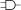
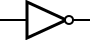
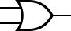
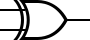
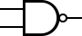

# Lecture Notes

Note that all slides annotated by me are in GoodNotes. 

## Meeting 6 - Floating Point ([empty slides](https://researcher111.github.io/uva-cso1-F23-DG/lectures/6-floating-point.pdf))


## Meeting 5 - Bitwise ([empty slides](https://researcher111.github.io/uva-cso1-F23-DG/lectures/5-bitwise-fp.pdf))

## Meeting 4 - Binary Arithmetic, ([empty slides](https://researcher111.github.io/uva-cso1-F23-DG/lectures/4-binary-bitwise.pdf))

### Review

We reviewed 1-bit and 2-bit muxes.

### Adder

Understanding Binary:

$1101_2 = 1 \times 2^3 + 1 \times 2^2 + 0 \times 2^1 + 1 \times 2^0 = 13_{10}$

Convert between decimal to binary:


## Meeting 3 - Binary Arithmetic, SSH ([empty slides](https://researcher111.github.io/uva-cso1-F23-DG/lectures/3-binary-arithmetic.pdf))

### Transistors

Two types:
- Push to close - on by default, off when pushed. I.e., adding a voltage to the gate turns it off.
- Push to open - off by default, on when pushed. I.e., adding a voltage to the gate turns it on.
    - in diagrams, these have the little circle on the gate

Bad Design:
- bad design occurs when you have a current that can both flow to the gate and to the drain. This shouldn't happen. 

### NAND Gates

Note that you can implement every other gate using NAND. 

### Building Component out of Gates

Muxes - Selects between one of _N_ inputs to connect to output. **Select** is $\log_2 (N)$ bits - control input. 

To solve this 1-bit mux, when S = 0, the output is whatever D0 is. When S=1, the output is whatever D1 is. 

YOu can then use 1-bit muxes to create 2-bit muxes. 

### BUilding a Digital Adding Machine

How can we support decimal numbers and negative numbers? Fractions? 


### How can we represent numbers? 


## Meeting 2 - Boolean Algebra ([empty slides](https://researcher111.github.io/uva-cso1-F23-DG/lectures/2-boolean-algebra.pdf), [video](https://uva.hosted.panopto.com/Panopto/Pages/Viewer.aspx?id=8a85f815-f052-46a0-85d8-b069010963a2))


### Transistor Fundamentals

- **metal oxide silicon** MOS transistors:
    - Polysilicon (used to be _metal_) gate
    - **Oxide** (silicon dioxide) insulator
    - Doped **silicon**

- Doped Silicon:
    - Pure silicon is a poor conductor (it has no free charges). 
    - Doped silicon is a good conductor (free charges). 
        - N-type (free _negative_ charges, electrons)
        - P-type (free _positive_ charges, holes)

#### Transistors Gates

1. **OFF**: No connection between source and drain
1. **ON**: Channel between source to the drain through the substrate by applying a voltage, $V_{dd}$. ($V_{dd}$ is supply)

    * G - Gate
    * S - Source
    * D - Drain

#### Pull Up Pull Down Networkw

- **nMOS**: Pass good **0's**, so connect source to GND
- **pMOS**: Pass good **1's**, so connect source to $V_{dd}$


#### Transistors as Switches

- nMOS 
    * default is off with no voltage

- pMOS 
    * default is on with no voltage

#### NAND Gate (using pull-up pull-down)


### Logic Gates

* Logic gates are circuits that perform functions such as AND, OR, (NOT), etc. 
* They have different symbols and their behavior is normally described using a truth table. 


#### AND

Consider AND:



| A | B | A AND B |
|---|---|---------|
| 0 | 0 | 0       |
| 0 | 1 | 0       |
| 1 | 0 | 0       |
| 1 | 1 | 1       |


#### NOT



$Y = \overline{A}$

zeroes go to 1, one goes to zero.

| A | Y |
|---|-------|
| 0 | 1     |
| 1 | 0     |

#### OR



$Y = A + B$

| A | B | Y |
|---|---|---|
| 0 | 0 | 0 |
| 0 | 1 | 1 |
| 1 | 0 | 1 |
| 1 | 1 | 1 |

#### XOR



$Y = A \oplus B$

| A | B | Y |
|---|---|---|
| 0 | 0 | 0 |
| 0 | 1 | 1 |
| 1 | 0 | 1 |
| 1 | 1 | 0 |

#### NAND



$Y = \overline{A \cdot B}$

| A | B | Y |
|---|---|---|
| 0 | 0 | 1 |
| 0 | 1 | 1 |
| 1 | 0 | 1 |
| 1 | 1 | 0 |

#### NOR


$Y = \overline{A + B}$

| A | B | Y |
|---|---|---|
| 0 | 0 | 1 |
| 0 | 1 | 0 |
| 1 | 0 | 0 |
| 1 | 1 | 0 |

#### XNOR


$Y = \overline{A \oplus B}$

| A | B | Y |
|---|---|---|
| 0 | 0 | 1 |
| 0 | 1 | 0 |
| 1 | 0 | 0 |
| 1 | 1 | 1 |


## Meeting 1 - Introduction

1. [Course Website](https://researcher111.github.io/uva-cso1-F23-DG/)
1. [Syllabus](https://researcher111.github.io/uva-cso1-F23-DG/syllabus.html)
1. [Schedule](https://researcher111.github.io/uva-cso1-F23-DG/schedule.html)
1. [OH](https://researcher111.github.io/uva-cso1-F23-DG/calendar.html)
1. [Labs](https://researcher111.github.io/uva-cso1-F23-DG/labs/)
1. [Readings](https://researcher111.github.io/uva-cso1-F23-DG/readings/)
1. [HW](https://researcher111.github.io/uva-cso1-F23-DG/homework/)
1. [Exam Review](https://researcher111.github.io/uva-cso1-F23-DG/exam_review.html)

### Goals

Students should be able to by the end of this course:

```c
#include <stdio.h>
int main() {
    printf("Hello World!\n");
    return 0;
}
```

1. Why is the stdio.h file needed? How does its associated code get added to the final binary? 
1. What binary is generated when the program is compiled? What instruction does the binary implement? 
1. How does the CPU execute the instructions? what components are needed in the CPU to make that happen? 
1. How can the program be optimized? How can we execute it with a smaller binary? 

### Office hours 

### Enrollment and Grading

Homework + Lab = 54%

Exams = 15%/each

Final = 16%

### Lectures

All lectures available via the course site. 

Lectures are about 35 minutes, and at the end of each lecture we'll look at a past exam question or a sample question, which you can then work on, solve, and review. 

All lecture slides are on the course website. Old lecture slides will remain on the course site until they are replaced by new lecture slides.

### Labs

Labs are in olson 18. 

Late lab attendance is equivalent to absence. Bring your laptop. 

Attending lab is 70%, submitting something is 10%, and passing all test cases is 20%. 

### Homework

Homework is due on GradeScope for auto-grading. **No limit on GradeScope submissions**.

Homeworks are due on Monday, no late work accepted. GradeScope will display your grade at then ed of the assignment period, and shows you what test
cases that you pass and fail. 

### Exams

Exams are in-class. Exam dates are on course website. 

You can take exams before but not after. 

### Things we'll cover

Bottom up approach. We'll start with transistors and move up. We'll be investigating transistors with the drain, gate, and source. 

Then, we'll move from transistors to building gates, and then from gates to building circuits. 

Next, we'll to go an ALU, which is an "arithmetic logic unit." From there, we can 

