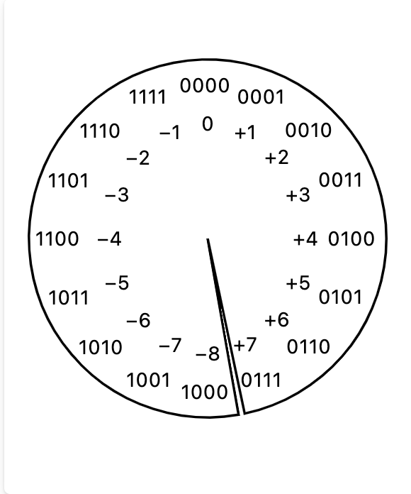
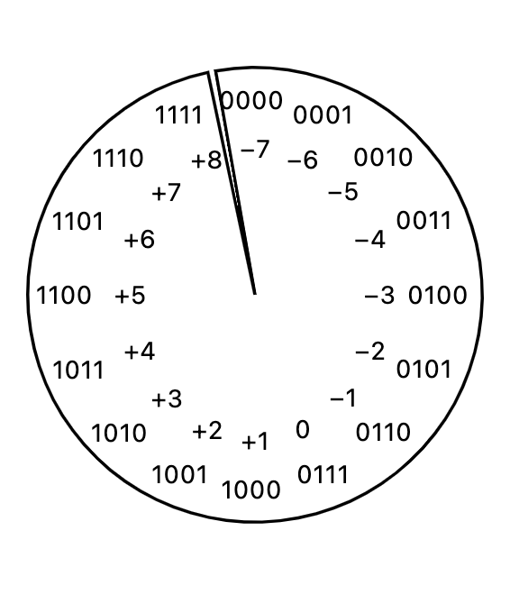
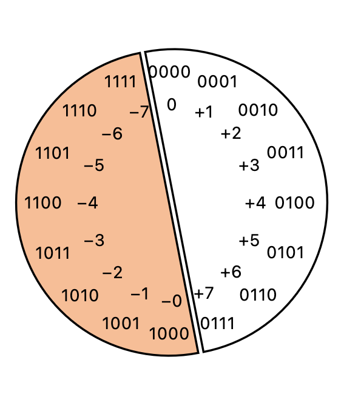
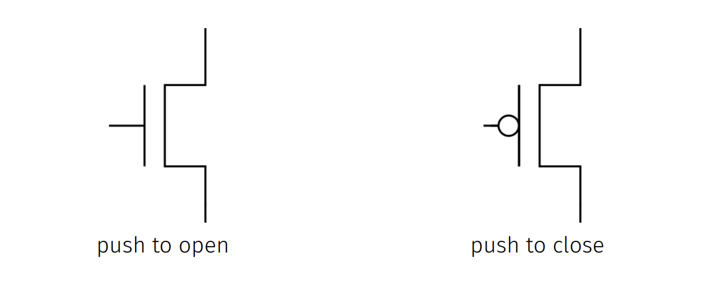

# Summer Notes & Practice for CSO

<!-- Table of Contents

- [Meetings 1 - 3](#meetings-1-3)
    - [Introduction](#introduction)
    - [Boolean Algebra](#boolean-algebra)
        - [Reading](#booleans---reading)
        - [Slides](#boolean-algebra---slides) -->

## Components of Digital Computers

### Current, Voltage, Power, Head

* **Current**: Rate at which electrons flow. 
* **Voltage**: the desire electrons to have flow; the electrical pressure (if you will). 1 is "high voltage" and 0 is "low voltage."
* **Power**: $\text{current} \times \text{voltage}$. It does not require power to maintain voltage without current, nor to maintain current without voltage.
* **heat**: the result of power dissipation. 

### Multi-bit "wire's" and "gates"

A multi-bit extension of a wire is just a cluster of wires/wires that run next to each other. Eight wires running next to each other can transmit 8 bits of information in their voltages. 

Note that it is almost never the case that all of the gates on all of the individual wires change at the same time at the same speed. That means that there are instances where outputs of logical components cannot be trusted for a value until completion. You can see this example with a 4-bit adder: when adding `0b0001` and `0b0110`, you get `0b0111`. Now change the second input to `0b0111`, there will be a moment in time where the adder is outputting `0b0100`, even though this is not correct. 

### Registers

Registers have one input and output, as well as a single-bit input or the clock. They store a value inside of them, and most of the time they completely ignore their input and output that internal value. 

Clock speed is measured in Hertz, which is the number of times per second that the clock changes from 0 to 1 and back to 0. Faster clocks mean more changes per second -> more power -> more heat. To overcome the limit on effective clock speed, we can make chips smaller and reduce the work done between each clock cycle (pipelining).

### Memory

Memory is a huge array/list of bytes, like a giant mux in front of a huge bank of registers. Processors interact w/memory through **loads** and **stores**. In a _store_, the processor sends it an address and one or more bytes and it changes the contents of the memory at those addresses. In a _load_, the processor sends it an address and a number of bytes and it sends back that many bytes from that address and the next few addresses.

### Code-to-Hardware Compilation

The process of compiling code to hardware is a multi-step process. There is software like VHDL and Verilog. 

1. Variables and assignment - a multi-bit of wires can be named as a variable but only named once. 
1. Operators - operators allow us to combine variables and constants to create new variables.
1. Registers/Memory - Registers are used to implement any type of circular dependency or change over time. Each register has an input/output, and with very few exceptions all computations register inputs from register outputs. 
1. Register-Transfer Level Coding - Each clock cycle runs as follows:
    * The clock signal goes low, causing registers to take their current inputs into their internal storage
    * The registers output their new values
    * The logic, with new inputs, begins to adjust, new values rippling through the gates until eventually a steady state is reached
    * Outputs of the logic are inputs to registers. 
    * Next rising edge causes everything to repeat. 

## Meetings 1-3

### Introduction

#### [Introduction - Slides](https://www.cs.virginia.edu/~jh2jf/courses/cs2130/spring2023/lectures/1-introduction.pdf)

- We will be going from 0s and 1s and transistors to logic gates to cpus to assembly to C. 
- Textbooks and readings:
    * Readings on course website
    * No required textbook
    * "Introduction to Computer Systems: From Bits and Gates to C/C++" by Patt and Patel
- For code editors, you may not use online compilers or editors, run code on the CS portal. 

### Boolean Algebra

#### [Booleans - Reading](https://www.cs.virginia.edu/~jh2jf/courses/cs2130/spring2023/readings/bool.html)

There are various ways to refer to the two types of bits - `true` and `false` or `set` and `cleared` or `high` and `low`. They are all representations of `1` and `0`. 

##### Core Operations

- `not` - Takes on input bit and produces one output but, represented by the following symbols:

|Formal Logic | $\neg P or \overline{P}$ |
|-------------|--------------------------|
|Code, bitwise| `~P`                     |
|Code, logical| `!P`                     |
|Circuits      |    |

The output is the opposite of the input, often use to "negate" or "invert" or "flip" its input.

> Note: the code symbol for "bitwise not" is ~, the "tilde." 

- `and` - Takes two input bits and produces one output bit, represented by the symbols:

|Formal Logic | $P \land Q$ |
|-------------|-------------|
|Code, bitwise| `P & Q`     |
|Code, logical| `P && Q`    |
|Circuits      |    |

The output is `1` when both inputs are `1`, otherwise, the output is `0`. It is said to find the "conjunction" of its inputs. 

- `or` - takes two inputs bits and produces one output bit, it is represented using the symbols:

|Formal Logic | $P \lor Q$ |
|-------------|------------|
|Code, bitwise| `P | Q`    |
|Code, logical| `P || Q`   |
|Circuits      |    |

The output is `1` when either input is `1`, otherwise, the output is `0`. It is said to find the "disjunction" of its inputs. It is also sometimes called the "inclusive or" (_p_ or _q_ or both) to distinguish it from the "exclusive or" (_p_ or _q_ but not both).

- `nand` - takes two inputs bits and produces one output bit, it is represented using the symbols:

|Formal Logic | $P \uparrow Q$ |
|-------------|----------------|
|Code, bitwise| `~(P & Q)`     |
|Code, logical| `!(P && Q)`    |
|Circuits      |    |

The output is `0` when both inputs are `1`, otherwise, the output is `1`. It is said to find the "not conjunction" of its inputs.

- `nor` - takes two inputs bits and produces one output bit, it is represented using the symbols:

|Formal Logic | $P \downarrow Q$ |
|-------------|-----------------|
|Code, bitwise| `~(P | Q)`      |
|Code, logical| `!(P || Q)`     |
|Circuits      |    |


- `xor` - takes two inputs bits and produces one output bit, it is represented using the symbols:

|Formal Logic | $P \oplus Q$ |
|-------------|--------------|
|Code, bitwise| `P ^ Q`      |
|Code, logical| `P ^^ Q`     |
|Circuits      |    |

The output is `1` when either input is `1` but not both or neither, otherwise, the output is `0`. 

`xor` can be created from the three basic gates: `p ^ q` is equivalent to `(p | q) & ~(p & q)` or (p & ~q) | (~p & q).

- `implies` - takes two input bits and, in other words, either P is false or Q is false, i.e. `~P | Q`. It is represented using the symbols:

|Formal Logic | $P \rightarrow Q$ |
|-------------|-------------------|
|Circuits |    |

- `multiplex` - an example of a common three-input boolean gate is the "multiplexer," which is also called a _"mux"_. A mux uses one of its inputs to decide which of the other two to output:

|`s`|`s ? p : q`|
|---|-----------|
|0|p|
|1|q|

##### Fancier Logic

Example: Suppose that we have two binary numbers we wish to add, using only basic logical operations. Each number is represented by a sequence of bits, $x_0$ is the 1s place of number $x$, $x_1$ is the 2s place, $x_2$ is the 4s place, and so on. We want to arrange a set of individual boolean operations to compute all the bits of $z$ where $z=x+y$. We'll proceed the same way we would by hand - with the least significant digit first. 

|$x_0$ | $y_0$ | $z_0$ | $\text{carry}_1$ | 
|------|-------|-------|------------------|
|0|0|0|0|
|0|1|1|0|
|1|0|1|0|
|1|1|0|1|

Notice that the $z_0$ column just looks like the `xor` table and that the $\text{carry}_1$ column looks just like the `and` table. Thus, we can configure the following:

```c
z0 = x0 ^ y0
c1 = x0 & y0
```

Now for $z_1$, this is the sum of $x_1$ and $y_1$, and the carry we just computed. Let's enumerate all possible 8 combinations for these three inputs:

|$c_1$ | $x_1$ | $y_1$ | $z_1$ | $\text{carry}_2$ |
|------|-------|-------|-------|------------------|
|0|0|0|0|0|
|0|0|1|1|0|
|0|1|0|1|0|
|0|1|1|0|1|
|1|0|0|1|0|
|1|0|1|0|1|
|1|1|0|0|1|
|1|1|1|1|1|

The $z_1$ column is the "parity" of $c_1$, $x_1$ and $y_1$, which can be computed by a pair of `xor`'s"

```c
z1 = c1 ^ x1 ^ y1
```

The $\text{carry}_2$ is more complicated, but notice that the entries when $c_1$ is `0` are the "and" table and the entries when $c_1$ is `1` are the "or" table. Thus, we can use $c_1$ like the selector of a `mux`:

```c
c2 = c1 ? (x1 | y1) : (x1 & y1)
```

This can also be represented as:

```c
c2 = (x1 & y1) | (c1 & (x1 ^ y1))
```

This then can be carried on to all later c's and z's"

```c
z2 = c2 ^ x2 ^ y2
c3 = (x2 & y2) | (c2 & (x2 ^ y2))
z3 = c3 ^ x3 ^ y3
c4 = (x3 & y3) | (c3 & (x3 ^ y3))
z4 = c4 ^ x4 ^ y4
c5 = (x4 & y4) | (c4 & (x4 ^ y4))
...
```
Thus, we have our adder:


##### Bit-Wise boolean operators in code

|Operator | Meaning | Example | 
|---------|---------|---------|
`&` | bit-wise and | 1100 `&` 0110 $\rightarrow$ 0100
`\|` | bit-wise or | 1100 `\|` 0110 $\rightarrow$ 1110
`^` | bitwise xor | 1100 `^` 0110 $\rightarrow$ 1010
`>>` | bit-shift to the right | 1101001 `>>` 3 $\rightarrow$  1101
`<<` | bit-shift to the left | 1101001 `<<` 3 $\rightarrow$  1101001000
`~` | bit-wise not | `~` 1100 $\rightarrow$ 0011

> When bit shifting, bits that no longer ift within the number are dropped. new bits are generally added to keep the number the same numbe rof bits; for left-shifts those new bits are always 0, for right shifts they are sometimes 0s and sometimes copies of whatever bit was in the left-most (highest-order) spot before the shift. Copying the high-order bit is called "sign extension" and is used to preserve the sign of a number when shifting it right.

##### Masks

A bit-mask or just a **mask** is a value used to select a set of bits from another value. These usually have sequential set of bits set to 1 while all others are 0, and are used with an `&` to select particular bits out of a value. 

They are typically represented in hexadecimal, where eah digit represents a four-bit binary value. For example, the mask `0x3ffe0` or (0011 1111 1111 1110 0000) selects 13 bits, the 5th-least-significant through the 17th. 

Bit-mask computed values are generally built using shifts and negations, such as `((~0) << 5) ^ ((~0) <<14)` generates to mask `0x3fe0` 

|Expression| binary | description | alternative constructions | 
|----------|--------|-------------|---------------------------|
`0` | `00000000000000000` | all zeroes | |
`~0` |`11111111111111111` | all ones | `-1` | 
`(~0)<<5` | `11111111111100000` | all ones shifted left 5 | `~((1<<5)-1)` | 
`(~0)<<14` | `11100000000000000` | ones with 14 zeroes in the bottom place | `~((1<<14)-1)` | 
`((~0)<<5) ^ ((~0)<<14)` | `00011111111100000` | 9 ones, 5 places from the bottom | `((1<<9)-1)<<5`

##### Bit Terminology

when discussing a sequence of bits, we can talk about them in many ways:

* **bit vector**: a fixed-length sequence of bits.
* **clear**: replace a single bit with 0 or replace all bits with 0. For example, to clear the 4th but of `x`, you'd do `x &= ~(1<<4)`. To clear `x`, you'd do `x &= 0`. To check if the 4th bit is clear, you'd do `(x & (1<<4)) == 0`. 
* **_i_ th bit**: The bit which would be in the 2^i^s place, i.e. the 3rd bit is in the 8th place. 
* **set**: Means making a bit 1. To set the 4th bit of `x`, you'd do `x |= 1<<4`.
* **zero**: Sometimes the opposite of 1 as relating to a single bit, or sometimes a bit vector of all 0 bits. 

##### Bit-sets and flags

Bit manipulation can be used to represent a set of (in this example boolean) values. For example, if our set of elements is {fun, important, required, useful, good prof, good time} we could say:

```c
FUN = 1<<0
IMPORTANT = 1<<1
REQUIRED = 1<<2
USEFUL = 1<<3
GOOD_PROF = 1<<4
GOOD_TIME = 1<<5
```

Then, we can represent `GOOD_TIME | FUN | GOOD_PROF` as 110001 or 0x31 or 49.

A flag is each of one-nonzero-bit value represented by bitwise or of zero or more flags. 

Given a set of flags-variable `x`,

|set operation | bit-wise parallel | 
|--------------|-------------------|
| $a \in x$ | `(A & x) != 0` |
$\{a\} \cup x$ | `A \| x` |
$x \backslash \{a\}$ | `x & ~A` |

| set datatype action | bit-wise parallel | 
|---------------------|-------------------|
|`x.contains(a) | `(x & A) != 0` |
|`x.add(a)` | `x |= A` |
|`x.remove(a)` | `x &= ~A` |

##### Bit-fiddling

Term for using sequences of operations to achieve various bit-level transforms of values. 


**Example**: Suppose you want to retrieve k bits from x, starting at bit i. You'd first shift x to the right so the last i bits are not there:

> x >>= i

and then mask out the last k bits

> x &= (1 <<k) - 1

**Exercise**: Consider the following bit-fiddling code:

```c
x ^= y
y ^= x
x ^= y
```

What does it do?

**Answer**: It swaps the values of x and y.

#### [Boolean Algebra - Slides](https://www.cs.virginia.edu/~jh2jf/courses/cs2130/spring2023/lectures/2-boolean-algebra-9am.pdf)

##### Vocabulary

* **bit**: either a 0 or a 1
* **binary**: a system that only has two positions
* **trinary**: a system that has three positions...
* ... **decmial**: a system that has ten positions

##### Electricity

Electricity (conceptually) involves the flow of electrons or other charged carriers through a conductive material. 

* **current**: rate of flow
* **voltage**: pressure of flow

For example, a water gun has high pressure and low flow, whereas a bucket of water has low pressure and high flow.

##### Transistors

Transistors act like an electrically-triggered switch. They have three terminals: a source, a drain, and a gate. When the gate is charged, the source and drain are connected. When the gate is not charged, the source and drain are not connected.

### Binary Arithmetic, ssh

#### [Bits (and beyond) - reading](https://www.cs.virginia.edu/~jh2jf/courses/cs2130/spring2023/readings/bits1.html)

##### Saying Anything with Bits

Any information can be presented in any format that contains enough bits. 

**Place-value numbers**

_base-10, "decimal"_: We know this as a place-value system. This means that we can write out the full places of the number string `314109` as:

> 314109 = 3 * 10^5 + 1 * 10^4 + 4 * 10^3 + 1 * 10^2 + 0 * 10^1 + 9 * 10^0

_base-2, "binary"_: Rather than using the digits 0-9, we use the digits 0-1. Thus in the base-2 system, the number string `110101` the first 1's value is thirty-two times larger than the last `1`'s value. We can represent the full place-values as:

> 110101 = 1 * 2^5 + 1 * 2^4 + 0 * 2^3 + 1 * 2^2 + 0 * 2^1 + 1 * 2^0

We can also see that the number's total value is $2^5 + 2^4 + 2^2 + 2^0 = 53$. Base-2 numbers of this sort are widely used to convert sequences of single-bit data into a larger many-bit datum. We call a binary digit a "bit." Math in binary is the same as in base-10 (read from left to right): 

```
            1      11      11    1 11    1 11
  1011    1011    1011    1011    1011    1011
+ 1001  + 1001  + 1001  + 1001  + 1001  + 1001
------  ------  ------  ------  ------  ------
             0      00     100    0100   10100
```

We tend to cluster bits together into 4-bit clusters (called "nibbles") or 8-bit clusters (called "bytes").

__base-16, "hexadecimal"_: Taken from the set of nibbles: {`0`, `1`, `2`, `3`, `4`, `5`, `6`, `7`, `8`, `9`, `A`, `B`, `C`, `D`, `E`, `F`}. For example, we can represent the number `d02` (also written as `0xd02`) as:

> d02 = d * 16^2 + 0 * 16^1 + 2 * 16^0 = d x 16^2 + 2 x 16^0 = 13 x 256 + 2x1 = 3330. 

It is very easy to convert to and from binary, as each "nibble" is just 4 bits. Thus:

| **d** | **0** | **2** |
|-------|-------|-------|
| 1101  | 0000  | 0010  |

1. 2^3 + 2^2 + 2^0 = 8 + 4 + 1 = 13
2. 0
3. 2^1 = 2

Thus, `d02` is `110100000010` in binary. Also, just like base-2 and base-10, math works the same in base-16: 

```
            1       1       1    1  1    1  1
  d0b2    d0b2    d0b2    d0b2    d0b2    d0b2
+ 300f  + 300f  + 300f  + 300f  + 300f  + 300f
------  ------  ------  ------  ------  ------
             1      c1     0c1    00c1   100c1
```

_bytes or octets_: 

base-256 uses bytes or octets, each being 2 nibbles or 8 bits. Octets are written using pairs of nibbles directly: {`00`, `01`, `02`, ... `fd`, `fe`, `ff`}. 

##### Base-2 Logs and Exponents

power-of-two numbers show up a lot in hardware and hardware-interfacing software. For example:

|Value | base-10 | Short form | Pronounced | 
|------|---------|------------|------------|
| $2^10$ | 1024 | Ki | Kilo|
| $2^20$ | 1,048,576 | Mi | Mega |
| $2^30$ | 1,073,741,824 | Gi | Giga |
| $2^40$ | 1,099,511,627,776 | Ti | Tera |
| $2^50$ | 1,125,899,906,842,624 | Pi | Peta |
| $2^60$ | 1,152,921,504,606,846,976 | Ei | Exa |

Note that the "i" clarifies that we mean the base-2 power, not the base-10 power. With that being said, simply saying "G" could mean either $10^9$ or $2^30$, which differ by about 7%. 

Note that $2^{27} = 2^72^{20} = \text{128M}$. This pattern works for any power of 2:

|Value | Split | Written | 
|------|-------|---------|
| $2^{27}$ | $2^7 2^{20}$ | 128M |
| $2^3$ | $2^3 2^0$ | 8 |
| $2^{39}$ | $2^9 2^{30}$ | 512G |

Logs with base 2 (written as $\log_2 (n)$ or $\lg(n)$ or just $\log(n)$) do the inverse of exponentiation. For example, $\lg(\text{64G}) = \lg(2^6 2^{30}) = \lg(2^{36}) = 36$.

Exercise: Fill in the rest of the table:

* hint, _the ones digit of the exponent becomes a number, the tens digit becomes a letter_

| Exponent | Written as |
|----------|------------|
17 | $2^7 2^{10}$ -> 128K
3 | $2^3$ -> 8
38 | $2^8 2^{30}$ -> 256G
11 | $2^1 2^{10}$ -> 2K
28 | $2^8 2^{20}$ -> 256M
34 | $2^4 2^{30}$ -> 16G
5 | $2^5$ -> 32


##### Negative Numbers

Here are three methods to deal with negative numbers

1. **Two's Complement**: picks a number and decides that that number and all numbers bigger than it are negative. This is typically half of the maximum number we can write, rounded up. 
    - For example, `0000 - 0001 = 9999` is `-1`, and thus `9998` is `-2`, and so on. 

    - This is the most common way to represent negative numbers in hardware. Notice that there is one more negative number than positive number. This is because we have to represent 0. 
    - _If you want to convert from negative to positive, flip all the bits, then add 1. If you want to convert from positive to negative, subtract 1, then flip all the bits._
    - To convert from positive to negative easily, find the least significant bit, keep everything UP to that bit, then flip the rest. For example, 20 is "00010100", and so then -20 is "11101100." see the example [here](https://youtu.be/n6taPbsRqV4).
1. ***Biased***: This version picks a fixed magical number (typically half of the maximum number we can write, rounded _down_) and calls it the "bias." So, for example, for numbers `0000` to `9999`, our bias would be `4999`. We then define the meaning of number `x` to be `x - bias`. 
    - For example, `5006` means `5006 - 4999` = `7`, and `4992 - 4999` = `-7`.  These are generally used to represent the exponent of floating-point numbers stored in binary.
    
    - Notice that there is one more positive number than negative number. This is because we have to represent 0.
    - To convert from the decimal, you need to first find the bias, then add it to the number. For example, if you are using 6-bit integers, the bias is 2^5 - 1 = 31. For example, to then convert 11 to biased, you would do 11 + 31 = 42, which is 101010 in binary.
1. **Sign bit**: This version is what we learned in grade school. We pick one bit to be the sign bit, and the rest of the bits are the magnitude. In binary, usually the negative sign is a `1` in the first bit, while a `0` there is equivalent to a positive sign instead.
    - Notice how this creates two zeroes, `+000` and `-000`. 
    
    - Notice how this creates two zeroes _and_ two discontinuities. Negative numbers move backwards, increasing in value when the unsigned representation would decrease.
    - Generally used for floating-point numbers. 

Exercise: Convert the following numbers from decimal to two's-C and Biased using 6-bit numbers. 

* note that the bias for 6-bit numbers is 31.

|Decimal | Two's-C | Biased |
|--------|---------|--------|
| 5 | 000101 | 100100 
| -5 | 111011 | 011010
| 11 | 001011 | 101010 
| -1 | 111111 | 011110 
| -13 | 110011 | 010010
| 31 | 011111 | 111110
| 16 | 010000 | 101111
| -15 | 110001 | 010000

##### On non-integral numbers

IEEE standards 754 and 854 define a particular representation that has received widespread implementation. These numbers are typically just called "floating-point numbers" or "floats" for short. These consist of three parts:

1. A sign bit, 0 for positive and 1 for negative. Always present in the highest-order bit.
1. An exponent, represented as a **biased** integer. Appears between the sign bit and the fraction
    * If the exponent is either all 1 bits or all 0 bits, it mensa something special. 
        * If the exponent is all 1 bits, then the number is either infinity or NaN (not a number). 
        * If the exponent is all 0 bits, then the number is either zero or a denormalized number.
1. A fraction, represented by a sequence of bits. Always occupies the low-order bits of the number. If the exponent suggested this was not the normal-case number, may have special meaning.

There are four cases of a floating-point number:

* **normalized**: the exponent bits are neitehr all 0 nor all 1. The number is represented by `s eee ffff` is $\plusmn \text{1.ffff} 
\times 2^{\text{eeee-bias}}$. The value 1.ffff is called "the mantissa".

* **denormalized**: The exponent bits are all 0. The number represented by `s 0000 ffff` is $\plusmn \text{0.ffff} \times 2^{1 - \text{bias}}$. The value of 0.ffff is the "mantissa."

* **infinity**: The exponent bits are all 1, and the fraction bits are all 0. The number represented by `s 1111 0000` is $\plusmn \infty$.

* **NaN**: The exponent bits are all 1, and the fraction bits are not all 0. The number represented by `s 1111 ffff` is NaN.

Exercise: complete the table assuming 8-bit floating-point numbers w/3 fraction bits.

* recall for bits, you have a sign bit, 4 exponent bits, and 3 fraction bits (in this example). So it will look like `s eeee fff`

| fraction | binary | binary scientific | bits |
|----------|--------|-------------------|------|
| $\frac{7}{8}$ | 0.111 | 1.11 x 2^(-1) | 0 0110 110 |
| $- \infty$ |  |  | 1 1111 000
| 1 | 1 | 1.000 x 2^0 | 0 0111 000 | 
| -240 | -11110000 | -1.111 x 2^7 | 1 1110 111
| $\frac{1}{64}$ | 0.000001 | 1.000 x 2^(-6) | 0 0001 000
| $\frac{7}{512}$ | 0.000000111	 | 1.11 x 2^(-7) | 0 0000 111
| $\frac{1}{512}$ | 0.000000001 | 1 x 2^(-9) |  0 0000 001


To get that number, first:
1. Sign bit: 0 since it's positive
1. Exponent: -1 + (bias), which is -1 + $2^{4-1} - 1 = 7$. So the exponent is 6, which is represented as 0110.
1. Fraction: obtained by taking the fractional part of the normalized fraction and representing it as bits, which is 110.


#### [Bits - Slides](https://www.cs.virginia.edu/~jh2jf/courses/cs2130/spring2023/lectures/3-binary-arithmetic-9am.pdf)

##### Transistors

* A transistor is a switch that can be turned on or off.



##### Trinary Operator

```python
x = b if a else c
```

``` java
x = a ? b : c;
```

- more photos of how to create this operator in the slides using circuits. 


##### Numbers & Bases

* Arabic Numerals
    * Positional numbering system where **10** is significant, 10 symbols using 10 as base of exponent.
* Base-8 example: $134_8$ in base-10 is $8^2 + 8^1 + 8^0 = 73$
* Bits that are long can be converted into bytes, which are 8 bits, or hexadecimals, which is 16 bits. 


### Other

#### Quiz 0

#### [Lab 1 - ssh, bash, and the cli](https://www.cs.virginia.edu/~jh2jf/courses/cs2130/spring2023/labs/lab1-ssh-ed.html)

#### [HW 1 - Bit Fiddling](https://www.cs.virginia.edu/~jh2jf/courses/cs2130/spring2023/homework/hw1-bit-fiddling.html)


