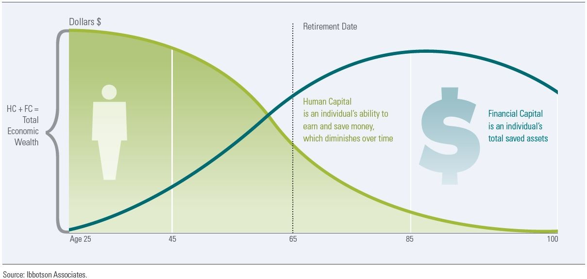

# Lecture Notes

## Day 2

### Your Assets

- **Human capital**: your ability to earn and save money, which diminishes over time.
- **Financial capital**: an individual's total saved assets
- **Total Economic Wealth** = Human Capital + Financial Capital

Your human capital diminishes and gets eclipsed (hopefully) by your financial capital around 65 years old.

### Asset Risks (Liabilities)

Types of Risk:
- **Personal risk**: injury, illness, death
- **Liquidity risk**: how quickly you can transfer an asset into cash w/o losing (most) value
- **Income risk**: unemployment, sickness, pandemic, etc.
- **Interest-rate risk**: the risk that the value of an asset will decrease as interest rates increase
- **Inflation risk**: the risk that the rate of inflation will increase more than the rate of interest on savings. Furthermore, prices will generally increase and the value of your money will decrease. Consider college education!

## Day 1 

### What is Financial Wellbeing?

_From the Consumer Financial Protection Bureau:_

1. Security
    - Control over day-to-day, month-to-month finances
    - Capacity to absorb a financial shock
1. Freedom of Choice
    - On track to meet financial goals
    - Financial freedom to make choices that allow you to enjoy life. 

### Housekeeping

Class participation is 5%. 

Homework problems (25%) and LearnSmart (25%) are **due by 7 a.m. the day of class.**

Group project is 15%. Email with names of team members and cc everyone oen team. 

Two assessments:

- Midterm 15% - on collab, take whenever.
- Final 15% - on collab, take whenever

Office Hours

1. RR Hall 134A monday and wednesday 9:30 - 10:30 AM 
1. By Appointment

### Bloom's Taxonomy

Using this to apply it to our financial decisions. Bloom's Taxonomy is a way of thinking about how we learn. Goal is to learn to make informed decisions and create our own plan to achieve our financial goals. 

1. Remembering  - knowledge
1. Understanding - comprehension
1. Applying - application
1. Analyzing - analysis
1. Evaluating - evaluation
1. Creating - synthesis

