# Readings

## Chapter 8: [Consumer Purchasing Strategies and Legal Protection](https://canvas.its.virginia.edu/courses/74463/assignments/368371?module_item_id=843071)

### LO8-1: Consumer Buying Activities

There are various influences that change buying habits. This includes economic factors, social factors, and personal factors. COnsider buying things to maximize purchasing satisfaction. 

_comparison shopping_ is the process of evaluating alternative stores/brands/prices, in contrast to _impulse buying_ which is unplanned purchasing. Try timing purchases so that they go on sale or when you have a coupon.

Pay attention to weather reports, news, economic conditions, political conflicts ads they affect your prices of daily goods. 

**cooperatives** are nonprofit organizations whose member-owners save money on various products and services. Cooperatives buy things in bulk and the savings are then passed on to members.

Branding:
* National brand products are highly advertised items in stores. 
* _store brand_ and _private label_ products are low-cost alternatives to name brand products.
* 

Pricing Comparison
* _unit pricing_ uses a standard unit of measurement to compare prices of different sizes. This can be done by dividing cost by number of units.
* _rebate_ is a partial refund of the price of a product. 
* _warranty_ is a written guarantee from the manufacturer/distributer that specifies the conditions under which the product can be returned/replaced. an _express warranty_ is created by the seller/manufacturer and has two forms: 
    * _full warranty_ - can be replaced/repaired during a reasonable amount of time
    * _limited warranty_ - covers certain aspects of the product.
* _implied warranty_ covers a product's intended use or other basic understandings that aren't in writing. 

Car Warranties:
* Used-car warranties - the FTC requires businesses that sell used cars to place a buyer's guide sticker in the window of the car. Most used cars come without a warranty. It should be inspected by a mechanic and receive a list of 14 major systems indicating major problems that may occur.
* New-car warranties - comes with a warranty including car part coverage, power train coverage, and corrosion warranty. Other conditions that will be incurred for major repairs happen in the form of a _deductible_. 

Service Contracts:
* **service contracts** are agreements b/w a business and a consumer to cover the repair costs of a product. They are also called _extended warranties_ but aren't actually warranties. 

### LO8-2: Major Consumer Purchases: buying a car

Phases:
1. Preshopping Activities:
    * Problem identification: Determine whether you need a car or just transportation.
    * Information Gathering: Reach out to personal contacts, business organizations, media sources, testing organizations, and others.
1. Evaluating Alternatives: can you afford it? How should you pay? What quality of car do you want? Can you rent instead of buying? 
    * Selecting Vehicle Options: consider mechanical devices, convenience options, and aesthetic features. 
    * Comparing Used vehicles: Consider the age, mileage, and condition of the car. They can be bought from many places and are often about 19k less than a new car.
    * Leasing: _leasing_ is a contractual agreement with monthly payments for the use of a car over a time period and then is returned. When leasing, know the _capitalized cost_ (cost of the car), _money factor_ (interest rate being paid on the capitalized cost), monthly payments and # of payments, and the _residual value_ (expected value of the car at the end of the lease). 
1. Determining Purchasing Price
    * Used-car price negotiation - find fair prices for your car depending on mileage and quality.
    * Price bargaining for new cars - the _sticker price_ is the manufacturer's suggested retail price. The _dealer's cost_ or _invoice price_ is an amount less than the sticker price. Negotiate for that. Some dealers are a _set price dealer_ with a no haggling strategy. 
    * Comparing alternatives: consider loans and _preapproval_ for loans. Avoid having an upside-down loan, wherein the car's value is less than the loan.
1. Postpurchase Activities:
    * Repairs - The largest fixed expense is due to _depreciation_, in addition to gas, oil, tires, and fixes. 
    * Maintenance - follow the manufacturer's recommendations for maintenance.

### LO8-3: Revolving Consumer Complaints

Consumer agencies estimate annual consumer losses due to fraud are over $30 billion. Before resoving a complain, know your rights and laws. A general process is:
1. Initial Communication - start at the sales location with a legitimate complaint. Be calm and rational.
1. Communicate with the company - express dissatistfaction through n email
1. Consumer Agency Assistance - contact a consumer agency for help. _mediation_ involves using a third party to settle greivances. _arbitration_ is a process in which both parties agree to have a third party hear their complaint and make a decision that is legally binding. 

### LO8-4: Legal Options for Consumers

Small Claims Cort
* A _small claims court_ is where you can settle small disagreements ot a dollar limit, set by the state. 
* This often takes place without a lawyer. The steps generally go as follows:
    1. notify the defendant to request a payment for damages with a deadline
    1. Determine location for filing the case
    1. Obtain/complete filing documents from courthouse/online
    1. FIle forms and pay fee, which are sent to defendant who must either deny or not contest the claim
    1. A hearing will be set. 
    1. Be clear and concise at the hearing
    1. Collect funds

Class Action Suits

a **class action** suit is a legal action taken by few individuals on behalf of all people who have suffered from the same alleged injustice. They are represented by a lawyer/group of lawyers. Funds are generally divided among the "class," which is the group of people who have suffered from the same injustice.

Using a Lawyer

Lawyers can come from the local bar association. Complicated matters like writing a will, real estate purchases, or other things may involve an attorney. 

Legal Alternatives
* _prepaid legal services_ are reduced-fee legal assistance for a set fee 
* _Legal aid society_ - network of publicly supported community officers providing legal assistance to people who cannot afford their own attorney. 
* _LegalZoom, Nolo, and Rocket Lawyer_ provided basic legal documents and other things

## [Chapter 7: Choosing a Source of Credit: The Costs of Credit Alternatives](https://canvas.its.virginia.edu/courses/74463/assignments/368375?module_item_id=843075)

### LO7-1: Sources of Consumer Credit

Avoid credit in two situations:
1. Do not need or really want a product that will require financing
1. You can afford to pay it in cash instead. 
    * their interest rates are often lower than credit card rates.
    * they are cheaper over many months or years when an extended payment period is needed.

What type of loan do you seek? There are two types of credit: closed-ended and open-ended. Installment loans may carry a lower rate, but credit cards are more flexible. 

Inexpensive Loans:
* Parents/family members. Can be complicated because of family relationships
* Commercial banks. Offer a variety of loans, interest rate on such loans range from 5-7%. 
* Financial aid like Stafford Loans

Medium-Priced Loans
* New-car loans,
* Borrow from credit unions (can offer same range of consumer loans that banks can). 

Expensive Loans
* Finance companies - Interest ranges from 8 to 20% and generally lend to ppl who cannot obtain credit from banks/credit unions.
* Check cashers/finance companies/others make small, short-term high-rate loans called "payday loans" which are extremely expensive. 
    * Suppose you write a personal check for 115 to borrow $100 for 14 days, the lender holds the check until your next payday, when you redeem the check by paying $115 in cash. Your cost of this loan is a $15 finance charge that is a 391% APR

Summary of Major credit Sources:

|Credit Source | Type of Loan | Lending Policies | 
| --- | --- | --- |
| Commerical Banks | single-payment loans, personal installment loans, savings account loans, check-creidt loans, credit card loans, second mortgages | Seek customers with established credit, often require collateral, deal with large loans, determine repayment schedules according to the purpose of the loan, vary credit rates according to the type of credit, time period, customer's credit history and security offered. | 
| Consumer Finance Companies | personal installment loans, second mortgages | often lend to consumers without credit history, often make unsecured loans, rates vary, offer repayment schedules that vary, higher percentage of loans are for small amounts, often charge higher rates than banks. |
|Credit Unions | Personal installment loans, share  draft-credit plans, credit card loans, second mortgages | lend to members only, make unsecured loans, may require collateral, may require payroll deductions, may submit large loan applications to a committee of members for approval | 
| Life insurance companies | single-payment or partial-payment loans | lend on cash value of life insurance policy, no date or penalty on repayment, deduct amount owed from value of policy | 
| federal savings banks | personal installment loans, education/savings account loans, second mortgages | will lend to all credit worthy individuals, have collateral, loan rates depend on size/length of payment. | 
| Payday loan | short term, immediate cash loans | high interest rates, allow a roll over period with additional fees | 
| online lenders | single-payment, small loans, short term, high-cost loans | loan applications are completed on website, funds transferred w/direct deposit, can be risky |

### LO7-2: Cost of Credit

_Truth in lending law_ fo '69 made creditors state the cost of borrowing as a dollar amount.

Finance Charge & Annual Percentage Rate
* **finance charge** is the dollar amount you pay to use credit. It includes interest costs and other service charges.
* ***Annual percentage rate (APR)** is the percentage of cost (relative cost) of credit on a yearly basis. This is key for comparing costs.
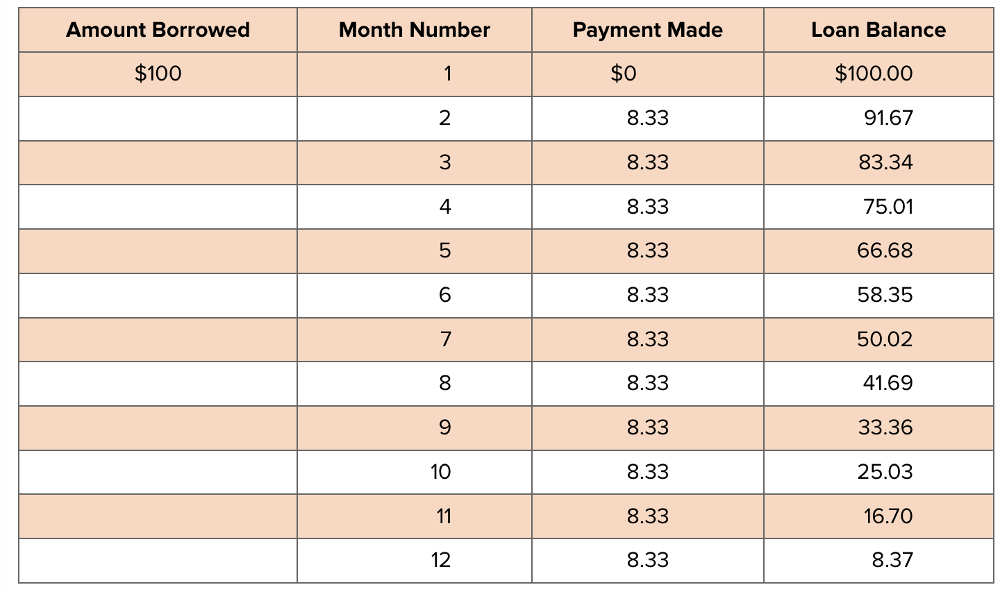
* To calculate APR, do $r = \frac{2 \times n \times I}{P(N + 1)}$
    * $r$ is Approximate APR
    * $n$ isi the number of payment periods in one year
    * $I$ is the total dollar cost of credit
    * $P$ is principal, or net amount of loan
    * $N$ is the total number of payments scheduled over the life of the loan

Trade Offs:
* Term versus interest costs - Many people choose longer-term financing because they want smaller monthly payments. Compare wisely. 
* Render risk versus interest rate - you may prefer financing that requires low fixed payments with a large final payments, or you may prefer a loan with a higher interest rate but no final payment.
    * Variable interest rate - inters rates can be variable or fixed. Decide which you want. 
    * Secured loan - if you pledge property/assets as collateral, you'll receive lower interest rate
    * up-front cash - can get better terms if you pay a larger down payment. You forgo interest that you may earn in a savings account though.
    * Shorter Term - shorter period of time for which you borrow, smaller chance that something prevents you from repaying/lower risk to lender. 

Calculating cost of Credit

* **simple interest** is computed on principal only and without compounding. Based on amount borrowed (_principal_), rate of interest, and the amount of time for which principal is borrowed. 
    * $\text{Interest} = \text{Principal} \times \text{Rate} \times \text{Time}$
* **Simple interest on the declining balance**: when more than one payment is made on a simple intererst loan, the method of computing is the _declining balance method_.
* **Add-on interest**: Interest is calculated on the full amount of the original principal. Immediately added to the original principal, and payments made by dividing principal + interest by the number of payments.

Cost of open-end credit:
* Credits must tell you how they calculate the finance charge.
* Creditors finance charges after subtracting the balance on which they assess finance charges. Some creditors add finances charges to the balance on which they assess finance charges (**adjusted balance method**). 
    * Others give you no credit for payments made during the billing period (**previous balance method**)
    * Under the third method, the **average daily balance method**, creditors add your balances for each day in the billing period and then divide by numbers of days in the billing period.

Cost of Credit and Expected Inflation:

Lenders seek to protect their purchasing power add expected rate of inflation to interest they charge. Ex: if a lender expects a 3% inflation rate and want 6% return, they charge 9%. 

Cost of credit and Tax Considerations - you can no longer deduct interest paid on consumer loans

RUle of 78s:
* **rule of 78s** is used to determine how much interest you have to pay at any point in a loan. Favors lenders. 

Compound Interest: $F = P(1+r)^T$ where:
* F = total future repayment value of a loan 
* P = principal amount borrowed
* R = rate of interest per year
* T = time in years

**Credit Insurance** ensures the repayment of your loan in the event of death, disability, or loss on property. Can include credit life, credit accident/health, and credit property. 

The Credit CARD AAct - 
* Limits card issuers' ability to raise APR on transferred balances
* Restricts card iussuers from applying new (higher) interest rates on existing card balances
* Requires companies to inform customers of rate increaes or other significant charges at least 45 days in advance
* Teaser rates must stay in effect for 6 months
* Requires card issuers to mail bills at least 21 days before payment is due
* Makes new disclosure statements clear and timely
* Display dates of statements on due dates with potential fees
* Restricts penalties that companies can charge
* Car issuers can't issue cards to consumers under 21 unless they have a cosigner or can demonstrate that they have independent means to repay debt

### LO7-3: Managing Your Debts

Debt Collection Practices - the FTC enforces the **Fair Debt collection Practices Act (FDCPA)** which prohibits certain practices by agencies that collect debts from creditors. Debt collectors are not allowed to contact you about a debt at a time/place that is inconvenient, can't contact you at work if your employer prohibits it. 

Don't be stupid w/your money and debt. 

### LO7-4: Consumer Credit Counseling Services

The **Consumer Credit Counseling Service (CCCS)** is a nonprofit with the National Foundation for Consumer Credit that provide debt counseling services. They have two main activities:
1. Aiding families with serious debt problems
1. Preventing debt problems with family budget planning and money management education.

Alternative counseling services:
* American Consumer Credit Counseling
* Financial Counseling Association of America
* InCharge Institute of America
* Money Management International

### LO7-5: Declaring Personal Bankruptcy

**Bankruptcy** is a legal process in which some or all assets of a debtor are distributed among the creditors became the debtor cannot pay their debts. This is a last resort option and damages your credit rating severely.

Bankruptcy Abuse Prevention and Consumer Protection Act of 2005 - avoided people from using bankruptcy as a way to avoid paying their debts. You have to pay back at least a portion of your debts. This makes credit more affordable. Law also required that
* Director of the Executive Office for the US Trustees develop financial management curriculum
* Debtors complete an approved instructional course on financial management
* Clerk of each bankruptcy district maintain a list of credit agencies/courses. 

**Chapter 7 Bankruptcy** is where a debtor is required to draw up a petition listing his/her assets and liabilities. Submits a petition to the US district court and pays a filing fee. 

**Chapter 13 Bankruptcy** is where a debtor with regular income proposes a plan for using future earnings/property to eliminate debts over time. It can have some costs:
* Court Costs - debtor pays filing fee to clerk of court. 
* Attorney's Fees - between 2-5k.
* Trustee's fees and costs - trustee is appointed by the court to administer the case.

Bankruptcy makes finding credit more difficult. But it can also make it easier since you cleared all your debts and they know you can't file for bankruptcy for another 7 years. Sometimes having a lawyer can help you get a better deal.

Chapter 

Personal Finance with Connect 14th edition, through the UVA Canvas inclusive access program. 

## [Chapter 6: Introduction to Consumer Credit](https://canvas.its.virginia.edu/courses/74463/assignments/368355)

### LO6-1: What is Consumer Credit

**Credit** is an arrangement to receive cash/goods/services now and pay for them in the future. **consumer credit** refers to the use of credit for personal needs (except a home mortgage) by individuals/families. 

Consumers usually have three alternatives in financing purchases - draw on savings, use present earnings, or borrow against their _expected_ future earnings. 

Credit can be used to buy stuff. College students are primary targets for credit card companies. Using credit increase the amount of money a person can spend to purchase goods/services now. However, make sure to consider the cost of credit. 

Credit cards permit the purchase of goods even when funds are low. They are also more efficient with returns in stores. They also are safer, as they let you shop and travel without carrying a large amount of cash. Some credit cards offer a "float" time in which you can pay off your balance without interest. Others offer cash back and other benefits, as well. Other benefits include death/injury insurance up to 250k, rental car insurance, roadside assistance, and extended warranties.

Despite the benefits, credit can be dangerous as it is very easy to overspend. Note that your credit does not increase your total purchasing power. Credit purchases are paid out of future income. 

### LO6-2: Types of Credit

1. **close ended credit**: Pay back one-time loans in a specific period of time in equal amounts. 
    * Mortgage loans
    * Automobile loans
    * installment loans
1. **open-ended credit**: 
    * Cards issued by stores/banks/cards
    * Travel/entertainment cards
    * Overdraft protection

Closed-End Credit

Used for a specific purpose and involves a specified amount. The borrower must repay the amount of the loan in a specified number of equal payments. The interest rate is usually fixed. Generally contains an agreement/contract with the terms. Three most common types are (1) installment sales credit (loan that allows you to receive merchandise and repay over a period of time) (2) installment cash credit (direct loan of money with no down payment and a payback plan) and (3) single lump-sum credit (loan that must be repaid in total on a day). 

Open-End (revolving) credit

Such as using your credit card. a _line of credit_ is a maximum dollar amount of credit th lender has available to you. You may have to pay interest (a periodic charge for the use of credit) or other finance charges. _incidental credit_ is credit arrangement that has no extra costs and no specific repayment plan. Banks extend _revolving check credit_ which is a pre-arranged loan for a specified amount that you can use by writing a special check (also called a _bank line of credit_).

Credit cards are super popular but only less than half pay off their balances in full each month. These cardholders are called _convenience users_. The rest are called _revolvers_ who pay only a portion of the balance each month. _co-branding_ is the practice of using a credit card with a business to offer points to a good/service. 

Stored-value cards, debit cards, and t&e cards are not ways to get credit.

Home equity loans are based on the difference between the current market value of your home and the amount you still owe on your mortgage. You can borrow up to 100k or more on your home. Home equity loans are generally set up as a revolving line of credit.

Don't be stupid with your credit cards, be safe, avoid phishing, etc. 

### LO6-3: Measuring your Credit Capacity

Before taking out a loan, make sure that you meet all your essential expenses. 

General rules of credit capacity:
* Debt payments to income ratio - calculated by dividing your monthly debt patens (not including house payments) by your net monthly income.

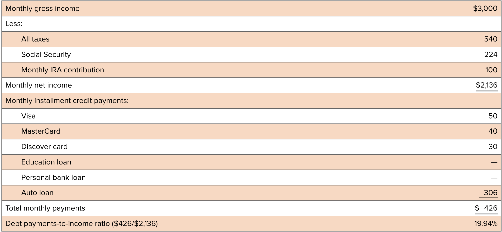

* Debt to equity ratio - calculated by dividing total liabilities by your net worth. Do not include your home value/its mortgage value. $\text{Ratio} = \frac{\text{Liabilities}}{\text{Net worth}}$
* If you are cosigning a loan, make sure you understand what that involves. Creditors are required to give you a notice to help explain your obligations. 
* Maintain your credit - credit experience can effect your job/ability to get insurance

**credit bureaus** or consumer reporting agencies (CRAs) collect credit and other information about consumers. 

Fair Credit Reporting: the _Fair Credit Reporting Act_ regulates the use of credit reports which requires the deletion of obsolete information and gives consumers access to their files. You can only get a creidt report to properly identified persons for approved purposes. Furthermore, it may only be reported for 7 years. 

### LO6-4: Applying for Credit

the Equal Credit Opportunity Acts starts all credit applicants on the same footing. Creditors are looking for character, capacity, capital, collateral, and conditions.
* Character - will you repay the loan? (borrower's attitude toward credit obligations)
* Capacity - can you repay the loan? (financial ability to meet credit obligations)
* Capital - what are your assets/net worth? (assets/net worth)
* Collateral - what if yuo don't repay the loan? (asset that you pledge to a financial institution to obtain a loan)
* Conditions - what general economic conditions affect your repayment of the loans?

If you are old enough to sign a legally binding contract, you cannot be turned down or decreased in credit because of age, you cannot be denied credit because of using Social Security. ECOA covers application for mortgage or a home improvement loan, bans discrimination on the obvious stuff. 

FICO Credit Store - number between 300 - 850 that rates how risky a borrower is. 

### LO6-5: Avoiding/Correcting Credit Mistakes

Best way to maintain credit is to repay debts on time. the Fair Credit Billing Act sets procedures for correcting billing mistakes, refusing to make credit card payments on defective goods. In case of billing error, notify the creditor in _writing_ within 60 days or after the bill was mailed. Creditor must acknowledge in 30 days.

Your credit rating cannot be threatened during a billing dispute. The FCBA ensures that you may withhold payment on any damaged or shoddy goods or poor services that you have purchased with a credit card. 

If you get your identity stolen, call fraud departments of Equifax, Experian, and TransUnion. Contact creditors for any accounts that have been tampered with/fraudulently opened, and file a police report. 

### LO6-6: Complaining about Consumer Credit

If you have a complaint with a creditor, contact them directly. If you have a complaint about a bank, get advice from the Federal Reserve System. 

Protection under Consumer Credit Laws:
1. truth in lending and consumer leasing acts - if a credit fails to give information/inaccurate information, you may sue for damages
1. Equal credit opportunity act - sue for damages if you think you've been discriminated against.
1. Fair Credit Billing Act - may sue credit reporting agency or creditor for violating rules regarding access to your credit records and corrections of errors in your credit file.
1. Consider Credit Reporting Reform Act - places burden of proof for accurate credit information on the credit reporting agency.
1. Credit Card Accountability, Responsibility ,and Disclosure Act of 2009 - places restrictions on credit card lending and eliminates certain fees.

## [Chatper 5: Financial Services - Savings Plans and Payment Methods](https://canvas.its.virginia.edu/courses/74463/assignments/368364?module_item_id=843064)

### LO5-1: Financial Services for Financial Planning

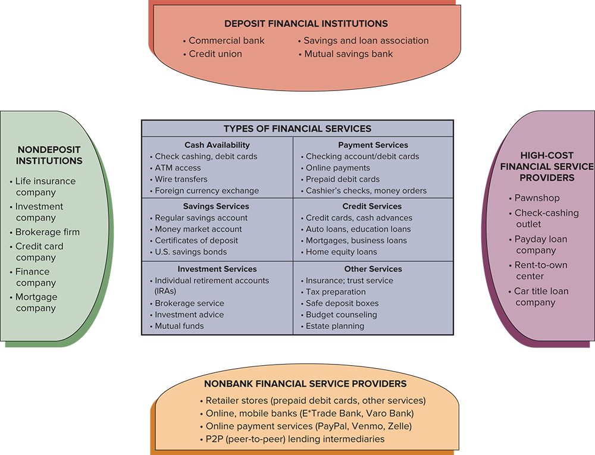

Mistakes when managing cash include:
1. overspending due to impulse buying
1. Having insufficient liquid assets to pay bills
1. using savings/borrowing for living expenses
1. Failing ot put funds into an interest-earning savings account/investment program.

Types of Financial Services
1. Savings - _time deposits_ are storage of funds for future use. 
1. Cash Availability and Payment Services - transferring money is necessary. Checking accounts (_demand deposits_) are the most common.
1. Borrowing - people use things like credit cards, cash loans, and long-term borrowing
1. Investing, other services - a _trust_ is a legal agreeement that provides for the management and control of assets by one party for the benefit of another. To monitor multiple accounts, use an _asset management account_ which is a comprehensive financial services package in a single account.

Banking

Banking transactions can be concducted with an ATM to minimize fees and save time. Video teller machines (VTMs) provide personalized service after hours with bank representatives. A _debit card_ activates banking and buying transactions. 

Banking Apps/Digital Wallets

Digital wallets are being used more and more. They allow storage of credit/debit/loyalty cards and allow P2P money transfers. 

Prepaid debit cards are a common payment methods. They can be loaded by cash/check, direct deposit, transfer, etc. and allow purchases, and P2P purchases, but are associated with heavy fees. Thus credit cards are the new alternative - _pay later_ rather than paying now. 

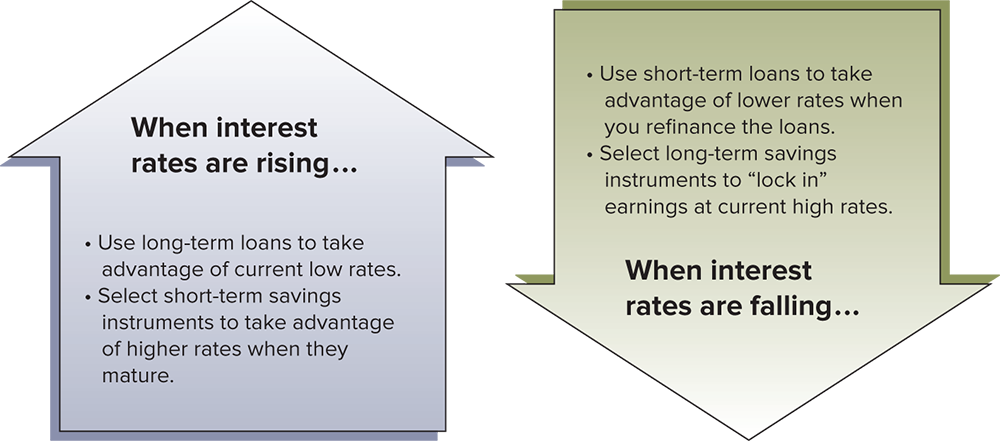

### LO5-2: Financial-Service Providers

Deposit Institutions - 
1. Commerical bank - offer a full range of financial services. They operate as corporations. 
1. Credit Unions - user-owned, nonprofit financial institution. 
1. Thrifts - S&L's offer financial services and _mutual savings banks_ are owned by depositors and specialized in savings/mortgages. 

Other Financial Institutions
* Life INsurance Companies - life insurance policies can contain savings/investment features. 
* Investment Companies - _mutual funds_ often offer the **Money market fund** which is a combination savings-investment plan in which the investment company uses your money to purchase short-term financial instruments. They are not covered by the FDIC.
* Brokerage Firms - serve as agents between buyer and seller for stocks & bonds. 
* Finance companies - making loands to customers and small businesses. Have short/intermediate term loans. 
* Credit Card Companies - specialize in short term retail lending. 
* Mortgage Companies - provide loans to buy homes. 

How to Compare Financial Service Providers

1. Identify most important features for a provider:
    * Services
    * Fees, earnings
    * Convenience
    * Online/mobile
1. Rank top features based on importance to your life situation
    * College student
    * Young Family
    * Older
1. Prepare a list of local, regional, national banks and credit unions
1. Research
1. Decide

### LO5-3: Savings Plans

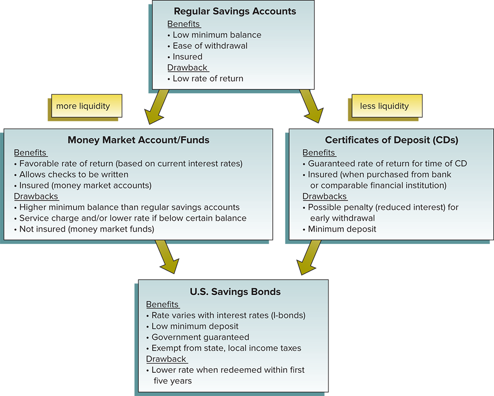

Savings Plans:
1. Savings Accounts: 
    * _regular savings accounts_ require a low minimum balance or none at all. They can allow withdraws. 
    * _high-yield savings accounts_ are offered by traditional banks and online-only banks but have restrictions on minimum balance and withdrawal limits. 
1. Certificates of Deposit - a _certificate of deposit_ (CD) is a savings plan requiring that for a certain amount be on deposit for a stated period (ranging from 30 days to 5 years or more) to earn a specific rate of return. Consider earnings and costs. If interest rates have dropped, consider a shorter maturity. Consider a portfolio of CDs that mature at different times. 
    * Rising-rate/bump-up CDs - higher rates at set intervals.
    * Liquid CDs - allow withdrawal without penalty. 
    * Zero-coupon CD - purchased at a deep discount with no interest payments. 6% annual return
    * Indexed CDs - have earnings based on the stock market. 
    * Callable CDs - start with higher rates and have long maturities like 10/15 years, 
    * Promotional CDs - "too good to be true" - often just sell you high-cost financial products. 
1. Money Market Account/Fund - a _money market account_ is a savings account that requires a minimum balance and has earnings based on the market. _accounts_ at banks and credit unions have federal deposit insurance but _funds_ don't. this is b/c funds invest in the short term (less than a year). 
1. Savings Bonds - bonds are a low risk investment in the treasury. 
    * EE Bonds - bonds over $25 that mature over time. SHould be redeemed after at least 5 years or you don't get all of your money. 
    * I Bonds - Has an interest rate based on (a) a fixed rate for the life of the bond and (b) an inflation rate calculated twice a year. EE bonds must be held at least a year. They are better for long-term savings. 

### LO5-4: Evaluating Savings Plans

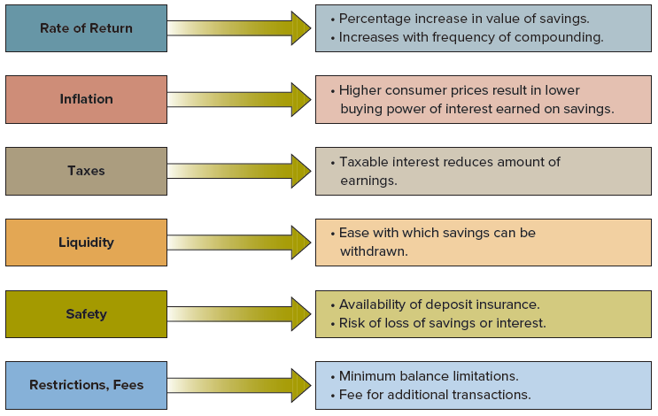

Rate of return - the earnings on savings are called the _rate of return_ or _yield_, which is a percentage of increase in the value of your savings from earned interest. The rate of return is calculated by:

$$\text{Rate of Return} = \frac{\text{Interest Earned}}{\text{Amount Saved}}$$

Compounding - the yield on your savings will usually be greater than the stated interest rate. _Compounding_ refers to the interest earned that is earned on previously earned interest. 

The more frequently compounding occurs, the higher your rate ofe return will be. To calculate the effective rate of return, use the following formula:

$$\text{Effective Rate of Return} = \left(1 + \frac{\text{Stated Interest Rate}}{\text{Number of Compounding Periods}}\right)^{\text{Number of Compounding Periods}} - 1$$

Truth in savings - the _Truth In Savings Law_ requires financial institutions to provide information about:
1. fees on deposit accounts
1. interest rates
1. annual percentage yield (APY)
1. other terms/conditions

This law defines the _annual percentage yield_ as the percentage rate expressing he total amount of interest that would be received on a $100 deposit based on the annual rate and frequency of compounding for a 1-year period.

$$\text{APY} = 100 [(1 + \text{Interest/Principal}^{\frac{365}{\text{Days in term}}})-1]$$

* Principal - amount of funds on deposit
* Interest - dollar amount earned during the term on the principal
* Days in term - number of days over which interest is earned. 

When the days of the term is 365 or the account doesn't have a stated maturity, the APY formula is just

$$APY = 100(\text{Interest/Principal})$$

Inflation - the reata of return your earn should be compared with the inflation rate. For example, at a time when inflation was over 10%, people earning 5-6% were experiencing a loss in buying power. 

Tax Considerations - taxes reduce interest on earned savings. For example, a 10% return for a saver in a 24% bracket means a real return of 7.6%. 
* To calculate:
    1. Determine your top tax bracket for federal income taxes
    1. Subtract this rate, expressed as a decimal, from 1.0
    1. Multiply the result by the yield on your savings account
    1. This number expressed as a percentage is your after-tax rate of return.

Safety - Savings accounts at every bank are insured by the FDIC to prevent a loss of money due to bank failure. Credit unions are insured by the NCUA. The FDIC insures up to 250k per depositor per insured financial institution. FDIC and NCUA also provide deposit insurance for retirement accounts. 

### LO5-5: Payment Methods

Payment Alternatives:
1. Digital - debit cards, online payments, prepaid cards, phones
1. Checking Accounts - traditional checking acccounts, checkless checking accounts
1. Other - certified checks, cashier's checks, money orders, travelers checks. 

Digital Payments:
1. Debit Cards - Processes transactions from your account. Can be used with your signature or PIN.
1. Online Payments - Banks and online companies serve as third parties to process payments. 
1. Mobile Transfers - Mobile transfers require registering a credit/debit card. P2P payments are also available.
1. Prepaid Cards - used for services and can be reloaded.
1. Digital Wallet - Smart cards can store data and your banking transactions. You can use digital wallets to make contactless transactions.

Checking Accounts
1. Traditional Checking Accounts
    * _regular checking accounts_ - usually have a monthly service charge and a minimum balance requirement.
    * _interest-earning checking accounts_ - pay interest on the balance in the account. If it goes below an amount you won't get your interest. a _share draft account_ is an interest-earning checking account at a credit union. 
    * _Activity Accounts_ - charge a fee for each check written/deposit but do not require minimum balance. 
1. Special Feature Checking accounts:
    * Targeted group accounts for seniors, adults, or military personnel
    * Rewards checking accounts - earn points, cash back, or a bonus interest rate
    * Premier checking accounts - offer several services for a monthly fee or a high min balance. 
1. Checkless checking accounts - no paper checks, all transactions through debit card, online, or mobile.

To evaluate a checking account...:
- Restrictions - minimum balance, fees, etc.
- Fes and Charges - consider monthly service charges, per-check fees, ATM fees, overdraft fees, etc.
- Interest - interest rate, frequency of compounding, interest computation method. 
- other services. _overdraft protection_

Managing your Checking Account
1. getting a checking account - determine if you want an _individual_ or _joint_ account. Get a signature card. 
1. Make deposits. Deposit tickets list cash and check amounts being deposited. Each check requires an endorsement: (a) a blank endorsement, just your signature, a (b) restrictive endorsement, consisting of the words "for deposit only", (c) a special endorsement, allowing the transfer of a check to someone else, and (d) a remote deposit capture deposits a check with an app photo. 
1. writing checks - record ate, write name of person/org receiving payment, record the check amount in figures, write the check amount in words, sign the check, note reason for payment. 
1. Reconciling your checking account - you can access your _bank statement_ and prepare a _bank reconciliation statement_ to compare your records with the bank's records.

## [Chapter 4: Planning your Tax Strategy](https://canvas.its.virginia.edu/courses/74463/assignments/368361?module_item_id=843061)

### Taxes and Financial Planning

Types of Taxes:
1. Tax on Purchases - _sales tax_ is both a state and local tax added to the purchase of products. Many states except food/drugs from sales tax. An _excise tax_ is imposed by federal and state governments on specific goods like gasoline, cigarettes, alcoholic beverages, tires, air travel, and phone service
1. Taxes on Property - _Real estate property tax_ is a major source of revenue for local government that taxes based on the value of land/buildings. Some areas also impose a _personal property tax_ that assesses taxes on the value of boats, cars, furniture, and other stuff. 
1. Taxes on wealth - _estate taxes_ are imposed on the value of a person's property at the time of their death. This tax is based on the fair market value of their investments, property, and bank account less deductions/other taxes. An _inheritance tax_ is levied on the value of property bequeathed by a deceased person. 
1. Taxes on Earnings - two main taxes on waves and salaries are Social Security and income taxes: 
    * _Social security_ is a federal program that provides disability and retirement benefits. It is funded by a tax on earnings paid by employees and employers.
    * _income tax_ is a tax on earnings that funds the federal government. It is based on the amount of income earned during a period. It can also be taxed thorough state and local governments.

### Income Tax Fundamentals

Americans are required to pay their share of income taxes to the federal government, which involves calculating taxable income, determining amount paid, and comparing this amount with the income tax payments withheld or made during the year. 

1. Determine Adjusted Gross Income - **taxable income** is the net amount of income, after allowable deductions, on which income tax is computed.There are various types of income:
    * **earned income** money from personal effort - wages, salary, etc. 
    * **investment income** money from property owned - interest, dividends, etc.
    * **passive income** - results from business activities in which you do not actively participate, such as a limited partnership.
    - >Total income is also affected by **exclusions** - an amount not included in gross income. Exclusions are also called **tax-exempt income** which is income not subject to tax. **tax deferred income** is income that will be taxed at a later date. This is something like an IRA. Finally, **adjusted gross income (AGI)** is gross income after certain additions/reductions have been made. This may be rental income or business profits. **Tax shelters** are investments that provide immediate tax benefits and a reasonable expectation of financial return. 
1. Computing Taxable Income - a **tax deduction** is the amount subtracted from adjusted gross income to arrive at a taxable income. Each taxpayer recieves a **standard deduction**, a set amount on which no taxes are paid. Some people qualify for **itemized deductions** which are expenses a taxpayer is allowed to deduct from adjusted gross income. This includes medical/dental expenses, state/local taxes (up to $10,000), interest on mortgages (up to $750,000 loan limit), contributions to charity, theft losses, moving expenses for active duty servicepersons, and job-related expenses. 
1. Calculating taxes owed - Your taxable income is the bases for computing the amount of your income tax. Use your taxable income in conjunction with the tax rate schedule to determine the amount of tax owed. Each of the tax rates represents a range of income levels. these are called _brackets_. To calculate tax on an amount of income, calculate the tax from each of the brackets as you progress up to your taxable income. On the other hand, the **average tax rate** is based on the total tax due divided by taxable income. The _alternative minimum tax (AMT)_ is designed to ensure that those who receive tax breaks with high incomes pay at least a minimum amount of tax. Tax owed can also be reduced by a **tax credit** which is an amount subtracted from the amount of taxes owed. This can be given for something like child care. Low-income workers benefit from _earned income credit (EIC)_ which is a refundable tax credit for low-income workers who have a job. There are more tax credits for education, adoption, and retirement savings.
1. Making Tax Payments - you can pay taxes through payroll withholding or through estimated tax payments:
    * **withholding** - the pay-as-you-earn system of tax payments. Employers withhold federal income taxes from your paycheck and send it to the IRS. At the end of the year you get a W2 which reports your annual earnings and the amount deducted for income/social security/state income tax. 
    * **estimated payments** - These people pay during the year and are based on a person's estimate of taxes due at year-end. These are made by self-employed people, those with investment income, and those with other income not subject to withholding.

    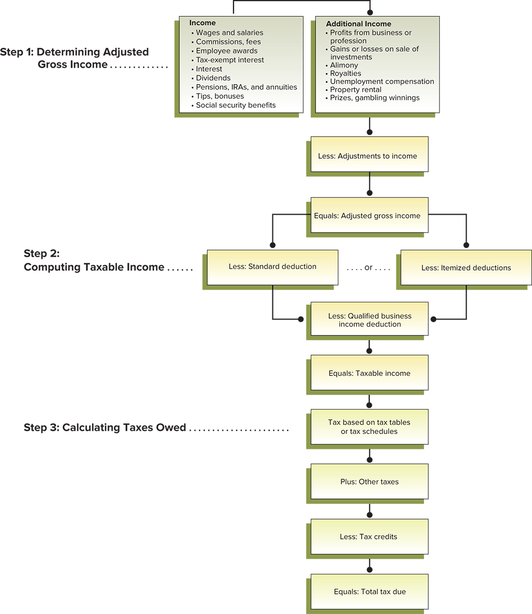

### Filing your Federal Income Tax Return

Who must file? 

Every citizen of the US must file taxes. This amount is based on the person's _filing status_. There are 5 categories:
1. Single
1. Married, filing joint return
1. Married, filing separate return
1. Head of household
1. Qualifying widow or widower

the _marriage penalty_ occurs for couples that have simliar income levels, and is an additional tax that couples pay filing as _married, filing jointly_ compared to filing as _single_.

What tax forms and schedules should you use? - the Tax Cuts and Job Act simplified the form when filing your taxes, as there's now one for (1040) to report your cumulative income.

Completing the federal income tax return:

1. Filing status - determine your filing status
1. Income - earnings from employment and other income
1. Adjustments to income - can deduct contributions to an IRA
1. Taxable income - your adjusted gross income is reduced by your itemized deductions or by the standard deduction for your tax situation. 
1. Other taxes - any special taxes
1. Tax credits - any tax credits are subtracted
1. Payments - total withholding and other payments
1. Refund or amount you owe - if your payments exceed the amount you owe, you are entitled to a refund. 
1. Signature

If you made an error, file a 1040X to pay additional tax/obtain a refund. 

Don't forget to file state income tax!

### Tax Assistance and the Audit Process

IRS Services:
1. Publications - IRS has lots of publications
1. Phone hot line
1. Walk in service
1. Interactive Tax Assistance
1. IRS2GO App

Tax Preparation Services

1. Tax services include one-person operations or national firms
1. Enrolled agents - government-approved tax experts
1. Accountants
1. Attorneys can help with a tax-related transaction when you disagree with the IRS

Warnings - when you hire a professional tax preparer, you are responsible for providing accurate and complete information. 

What if your return is audited? a **tax audit** is a detailed examination of your tax return by the IRS. They usually request more information to support he entries on your tax return. Keep receipts, and other things to prove your claim. Note that < 1% of people are audited. There are types of audits:
    * _office audit_ requires you to visit the IRS office
    * _field audit_ an IRS agent visits your home and accesses your records. 

Know your audit rights - bring a lawyer, be on time, be consistent with your information. 

### Tax Planning Strategies

People practice **tax avoidance** which is the use of legitimate methods to reduce taxes (in contrast to illegal **tax evasion**). 

Here are some general strategies to avoid taxes:
1. If you have the same or lower tax rate next year, accelerate deductions into the current year. Pay real estate property taxes early, make charitable contributions, etc.
1. If you expect to have lower or the same tax next year, delay the recipes of income until next year, as it will be taxed at a lower rate.
1. If you expect to have a higher tax rate next year, consider _delaying deductions_ since they will have a greater impact on your taxes next year.
1. If you expect to have a higher tax rate next year, consider _accelerating income_ into the current year.

Special Tax Situations
1. Business in your home - deduct ordinary expenses relating to your business, which could include your home/mortgage
1. Divorced persons - child support payments have no tax consequences. 
1. Single parents - can claim _head of household_ filing status 
1. Retired persons - can withdrawal tax-deferred funds without penalty (over 59.5)

Consumer purchasing affects your taxes:
1. Place of Residence - owning a home is a tax shelter - real estate property taxes and interest on mortgage are deductible.
1. Consumer Debt - tax laws allow homeowners to borrow for consumer purchases. You can deduct interest on loans (up to 100k). 
1. Health Care Expenses - _Flexible spending accounts (FSAs)_ allow you to reduce your taxable income when paying for medical or child care costs. _Health Savings Accounts (HSAs)_ are another type of health savings account that allows you to reduce your taxable income when paying for medical expenses.

Investment Decisions 
1. Tax-Exempt investments - interest from bonds are tax-exempt. 
1. Tax-deferred investments
    * _tax deferred annuities_ - allow you to postpone taxes on your investment earnings until you withdraw the money.
    * _section 529 savings plans_ - state run tax-deferred plans to set aside moeny for a child's education
    * _Retirement plans_ - such as an IRA, Keogh or 401(k) allow you to postpone taxes on your investment earnings until you withdraw the money.
1. Capital gains and losses - a _capital gain_ is the profit from the sale of assets such as stocks, bonds, or real estate. YOu only pay taxes once the asset is sold A _capital loss_ is the sale of an investment for less than its purchase price. Capital gains are taxed at a lower rate than ordinary income. 
1. Self employment - you can write off home costs as a business expense.
1. Children's Investments - _income shifting_ allows you to shift income to children who are in a lower tax bracket.

Retirement and Education Plans
1. Traditional IRA - contributions are tax deductible, but withdrawals are taxed as ordinary income.
1. Roth IRA - allows a $6k annual contribution which is not tax deducitble but the earnings on the account are tax free after five years and after age 59.5
1. Coverdell Education Savings Account - assists parents to pay for children's education. 
1. 529 Plan - educational savings plan. 
1. Keogh plan - tax-deferred retirement plan for self-employed people.
1. 401(K) plan - tax-deferred retirement plan for employees of corporations.

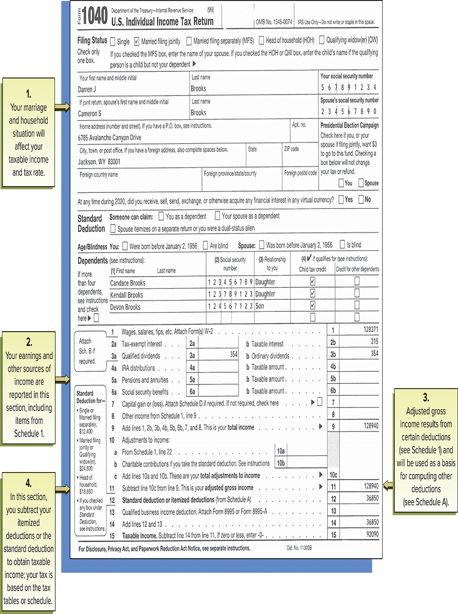

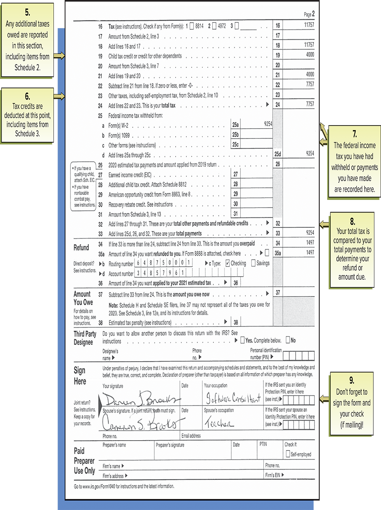

## [Chapter 3: Money Management Strategy: Financial Statements and Budgeting](https://canvas.its.virginia.edu/courses/74463/assignments/368356?module_item_id=843056)

### LO3-1: Successful Money Management

**Money management** refers to the day-to-day financial activities necessary to manage current personal economic resources while working toward long-term financial security. 

Opportunity Cost and Money Management: 
- current spending reduces money available for long-term saving and investing
- increased saving/investing lowers what you can spend now
- credit payments over time reduce future income available for spending and saving
- using savings to buy things results in lost interest and not being able to use savings for other things
- comparison shopping results in wiser buying but loses your time. 

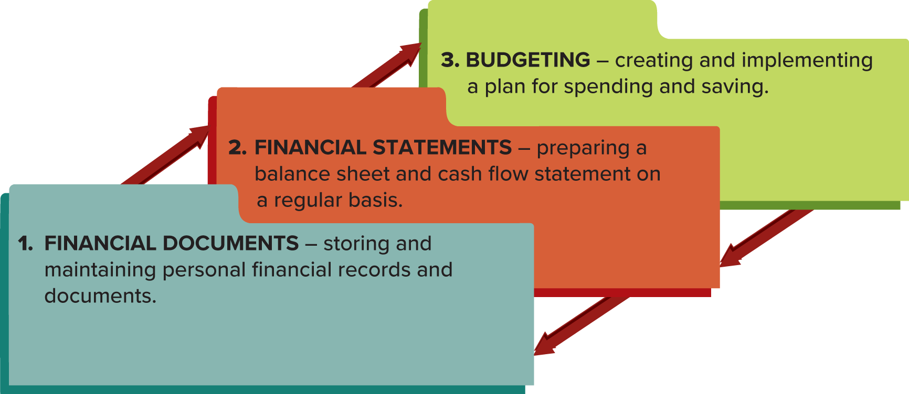

Personal records system: reciepts, credit cards, insurance policies, and tax forms report personal financial activities. Organizing a system provides:
1. handling daily activities like bill paying
1. measuring financial progress
1. completing tax forms
1. making investment decisions
1. determining resources for spending. 

Where to keep financial records:

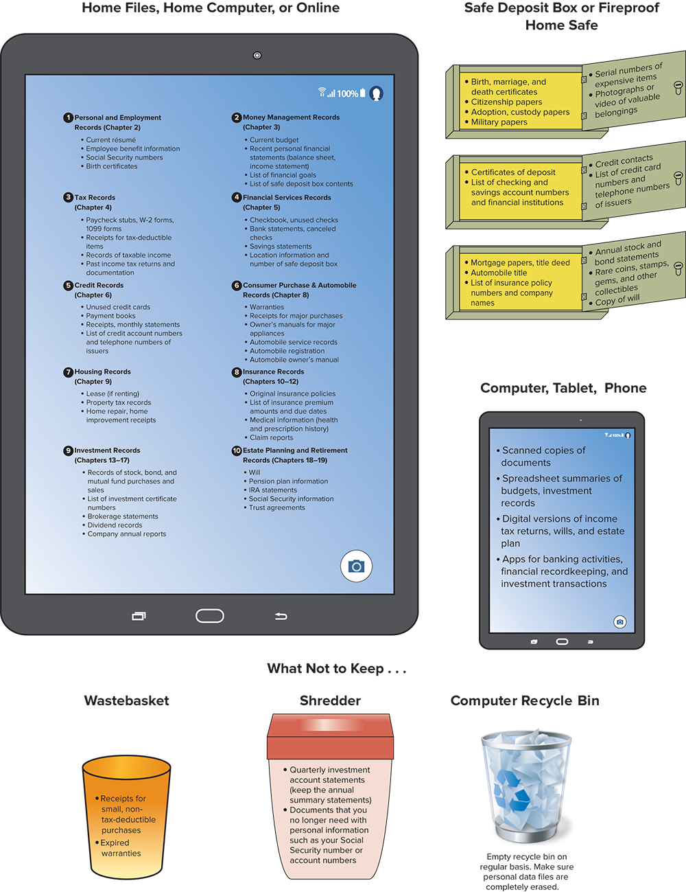

Important records should be stored in a **safe deposit box** which is a private storage area at a financial institution with maximum security for valuable and difficult-to-replace documents. It requires two keys. 

If you are storing records electronically, you should:
1. Download copies to local storage
1. Back up files externally to cloud or to a hdd
1. secure data with encryption
1. Scan copies of documents you need with paper versions. 

You should keep certificates like wills, birth certs, and social security data. You should keep investment records loins term and tax records for at least three years. 

### LO3-2: Personal Financial Statements

_personal financial statments_ are the starting point for your financial jouirnet. They are documents that provide information on your current financila position and a summary of income spending. Their main purpose is to:
    * report current financial position based on the value of items you own and amounts you owe
    * Measure your progress toward financial goals
    * Maintain information about your financial activities
    * Provide data for preparing tax forms or applying for credit

A _balance sheet_, otherwise known as a _net worth statement_ or _statement of financial position_ reports what you own and whawt you owe. For example:

$$\text{Items of value (what you own)} - \text{Amounts owed (what you owe)} = \text{Net worth (your wealth)}$$

Listing items of Value:
* **assets** are cash or other tanigble property with a monetary value. 
    * Liquid assets are cash items and items of value that can quickly be converted to cash. 
    * Real estate includes a home, apartment, or other land that a person/family owns
    * Personal possessions are a major portion of assets for many people. These include cars, furniture, appliances, jewelry, etc. These are usually hard to convert to cash. 
    * INvestment assets are funds set aside for long-term financial needs.

Determine Amounts Owed:
* **Liabilites** are amounts owed to others but do not include items yet due, such as next month's rent. 
    * Current Liabilities - debts you must pay within a short time, less than a year. 
    * Long-term liabilities - debts you do not have to pay in full until more than a year from now. A _mortgage_ is an amount borrowed to buy a house or other real estate paid over 15 years or more.

Compute Net Worth

$$\text{Assets} - \text{Liabilities} = \text{Net Worth}$$

**insolvency** is the inability to pay debts when they are due, when their liabilities exceeded available assets. Actions to increase net worth include increasing savings, reducing spending, increasing value of investments/possessions, and reducing amounts owed. 

Cash Flow Statement - **cash flow** is the actual inflow and outflow of cash during a time period. Income is the most prominent _inflow_ of cash, whereas payments like food/rent are cash _outflows_. 

A Cash flow statement, also known as a _personal income and expenditure statement_ is a summary of cash receipts and payments for a time period.  Deposits are _inflows_, and purchases are _outflows_. 

To prepare a cash flow statement:
1. Record income - _income_ is the inflows of cash for a person/individual/household. **Take home pay** and _net pay_ is a person's income after taxes and other deductions. **discretionary income** is money left over after paying for a house, food, and other necessities. 
1. Record cash outflows:
    * _fixed expenses_: payments that don't vary from month to month. Rent, mortgage, loans, wifi service, etc. 
    * _variable expenses_: food, clothing, utilities, recreation, etc. 
1. Determine net cash flow. This can either be a positive (_surplus_) or negative (_deficit_). Set aside money for an _emergency fund_. 

Ratios for Evaluating Financial Progress:

|Ratio| Calculation | example | interpretation | 
|---|---|---|---|
Debt ratio | liabilities divided by assets | $25000 / 50000 = 0.5$ | shows relationship between debts and assets, a low debt ratio is best. |
Current ratio | liquid assets divided by current liabilities | $4000/2000 = 2 | indicates 2 dollars in liquid assets for every 1 dollar of current liabilities. |
Liquidity ratio | liquid assets divided by monthly expenses | $10000 / 4000 = 2.5 | indicates the number of months in which living expenses can be paid if an emergency comes up, a high liquidity ratio is good. | 
|debt-payments ratio | monthly credit payments divided by take-home pay | $540 / 3600 = 0.15 | how much of a person's earnings goes for debt payments| 
Savings Ratio | Amount saved each month divided by gross income | $648 / 5400 = 0.12 | financial advisors recommended monthly savings of 5-10%. |

### LO3-3: Budgeting for Skilled Money Management

An _achiever_ is a personal with a strong financial base whereas an _explorer_ is a person seeking to get to the next level of financial success. A _striver_ is a personal with minimal financial resources. 

A _budget_ is a spending plan necessary for financial planning. It serves the purpose of:
1. Living with your income
1. Spending money wisely
1. reaching financial goals
1. Preparing for financial emergencies
1. develop wise financial management goals. 

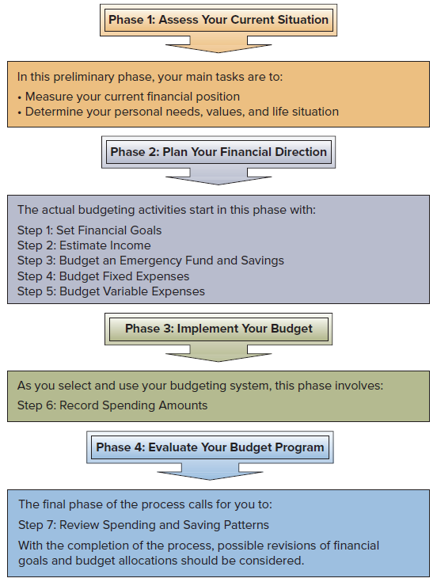

Budgeting Process:
1. Set Financial Goals - Your goals should take a SMART approach and nbe specific to who you are (single, married, single parent). You should be aided by your _balance sheet_ reporting your current financial position, your _cash flow_ reporting your inflows and outflows, and your _budget_ setting a plan for spending and saving. 
1. Estimate Income - Estimate it usually monthly (or usually whenever you get paid). 
1. Budget an emergency fund and savings - Financial advisors suggest an _emergency fund_ of 3-6 months for living expenses in bad times. Also, _sinking funds_ are for non-monthly expenses that occur during the year. People also can put these funds into separate savings accounts, called _savings buckets_. The time value of money refers to increases in savings as a result of interest earned. 
1. Budget fixed expenses - Define A budget involves both fixed expenses and _projected_ income/expenses. 
1. Budget Variable Expenses - You can look at the CPI. 
1. Record spending amounts - A **budget variance** is the difference between the amount of budget and the actual amount received/spent. 
1. Reviewing Spending and Savings Patterns - Budgeting is an ongoing progress. 

Characteristics of a good budget:
* Well planned - take time and learn lessons. 
* Realistic - A budget is not to prevent you from enjoyingl ife but also won't let you immediately get a car. 
* Flexible - be prepared for unexpected circumstances
* Clearly Communicated - Should be available and understood by all family members.

Types of Budgeting Systems
1. Mental budget - a budget that is not written down but kept in mind. can be dangerous if you forget.
1. Physical budget - involves physical ways to hold money and tracking. 
1. a written budget contains a plan and a budget record book
1. digital budget - created with a spreadsheet and other financial institutions offer budgeting tools.

### LO3-4: Money Management and Achieving Financial Goals

You can achieve financial statements with:
1. A balance sheet - where you are now
1. A cash flow statement detailing income and spending during a month
1. A budget recording plans for spending/saving your financial goals.

Identifying Saving Goals - common uses for saving reasons include:
* Create an emergency fund
* pay for expensive items like appliances, cars, or to make a down payment on a house
* Buy expensive items
* long-term expenses like education for children
* Earn income from interest on savings

To expand saving, use payroll deductions to automatically deposit money into a savings account, save 5-10% of your income, and take advantage of employer retirement funds.

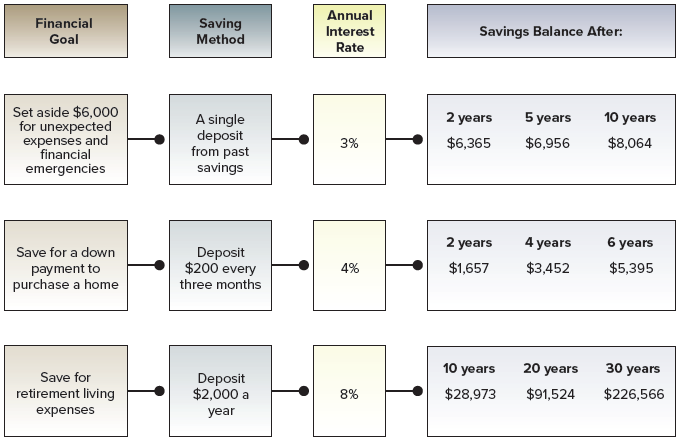

## [Chapter 2: Financial Aspects of Career Planning](https://canvas.its.virginia.edu/courses/74463/assignments/365279)

### LO2-1: Career Choice Factors

The lifework you select is key to financial wel-being and personal satisfaction. You may obtain a **job**, an employment position obtained mainly to earn money. You may also select a **career**, a commitment to a profession that requires continued training for professional growth. 

Trade-offs of career decisions:

Your employment most likely effects most of what you do. This includes time, business associates, income, etc. Career choices often involve opportunity costs based off of personal, social, and economic factors. 

The level of formal training also affects financial success. For example, more education increases your _potential_ earning power and reduces your _potential_ for unemployment, along with other factors. 

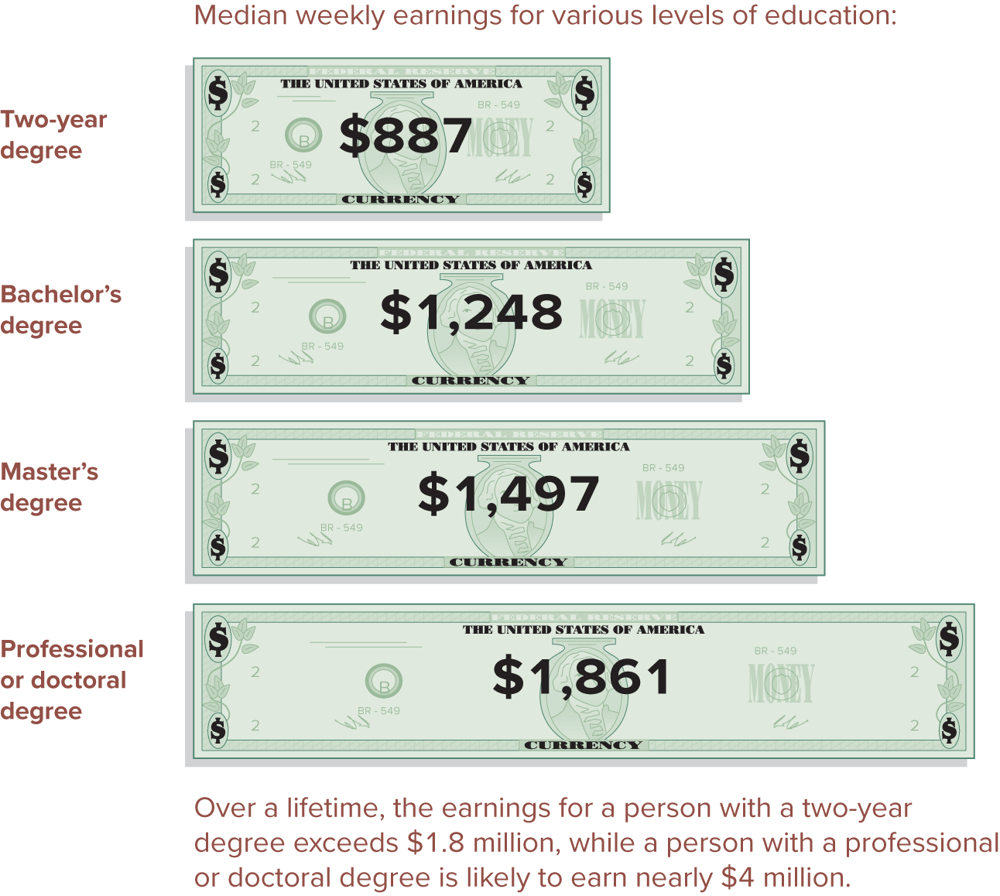

People can also market themselves with _employability skills_, also called _transferrable skills_ which refer to basic capabilities that are needed for obtaining, maintaining, and advancing a career. Your readiness can be put into two categories:

1. **technical skills**: _hard skills_ are needed for a specific profession - including IT, accounting, law, engineering, health care, etc.
1. **general skills**: _soft skills_ are needed in all careers/work situations, and can be acquired through school or also work experience. They include but aren't limited to:
    * Work well with others
    * take initiative to overcome obstacles
    * An interest in learning
    * Willingness to cope with conflict
    * etc.

A career can be influenced by personal factors. _Aptitudes_ are natural abilites that people possess, such as artistic, mechanical, or mathematical. _Interest inventories_ determine activities that give you satisfaction in various work situations. 

Career decision-making is important, and having a good approach to career planning, advancement, and change can help you make good decisions. 

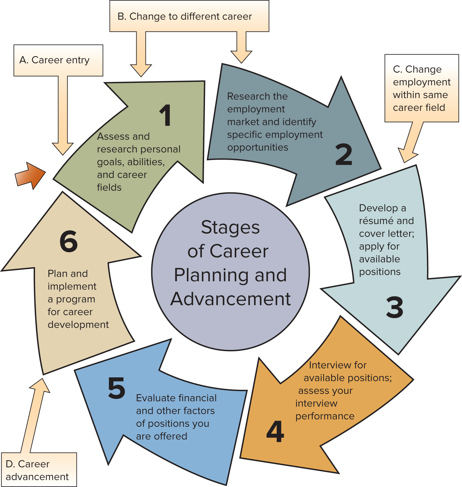

### LO2-2: Career Opportunities: Now and in the Future

Your job search should start with an assesment of the career choice factors shown below:
1. Social influences - demographic trends, geographic trends
    * Demographic trends - the people around you demand certian things and thus create jobs.
    * Geographic trends - consider salary levels and costs of living.
    * Cost of living differences: 

    $$\frac{\text{City 1}}{\text{City 2}} = \frac{\text{index number} \times \text{Salary}}{\text{index number}} = \text{buying power}$$

    For example, a person earning $30,000 in Omaha, Nebraska would need to earn $39,550 in Chicago to have comparable buying power. 

1. Economic conditions - interest rates, inflation, demand
    * INterest rates, price fluctuations, or changing global demand for goods and services affect career opportunities, most of which are out of your control.
1. Industry trends - foreign competition, changing uses of technology. Most industries that have the greatest potential for employment are:
    * _Technology_ - analyst, engineer, cloud admin, web dev, service tech, DevOps
    * _Health Care_ - nurse, physician, therapist, pharmacist, medical assistant, medical records
    * _Medical Technology_ - medical lab tech, medical records, medical billing
    * _Environmental Services_ - environmental engineer, environmental scientist, environmental technician
    * _Business Services_ - accountant, auditor, financial analyst, HR specialist, marketing specialist, management analyst
    * _Social Services_ - social worker, counselor, teacher, child care worker, clergy
    * _Marketing, sales, retailing_ - sales rep, sales manager, retail sales, marketing manager, marketing research
    * _Hospitality/Food Services_ - chef, cook, food prep, waiter, bartender, hotel manager
    * _Education_ - teacher, administrator, librarian, coach, counselor
    * _Financial Services_ - accountant, auditor, financial analyst, financial manager, loan officer

### LO2-3: Employment Search Strategies

Obtaining Employment Services
1. _Part-Time Employment_: summer/part-time is important to get into a career field and get work experience.
1. _Volunteer Work_: Involve in community organizations and projects.
1. _Internships_: In competitive fields, they can give needed expertise and contacts for available jobs. 
1. _Campus Projects_: Clubs, public speaking, planning, finances, etc.

Career Information Sources:

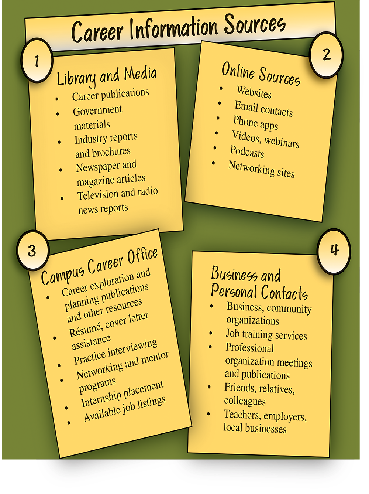

* Career Dev Office - campuses offer this to help with Resume, cover letter, interview prep, and helps to also connect with a network.
* Networking - the process of making and using contact to obtain and update career information. The main sources of networks include community orgs, professional associations, business contacts, and social media.

For effective networking, you should:
1. Prepare a 30 second elevator pitch
1. Ask questions to learn about others
1. Volunteer at events of professional organizations. 

Yu can get an _informational interview_ which is a meeting at which you gather information about a career or organization. To prep for this, you can:
* Prepare a list of industries you'd like to work in and contacts within them
* Prep open-ended questions
* Make the appointment for a 20 minute meeting strictly about information
* interact and talk about work environment
* follow up with a nice email.

Career Planning Strategy:

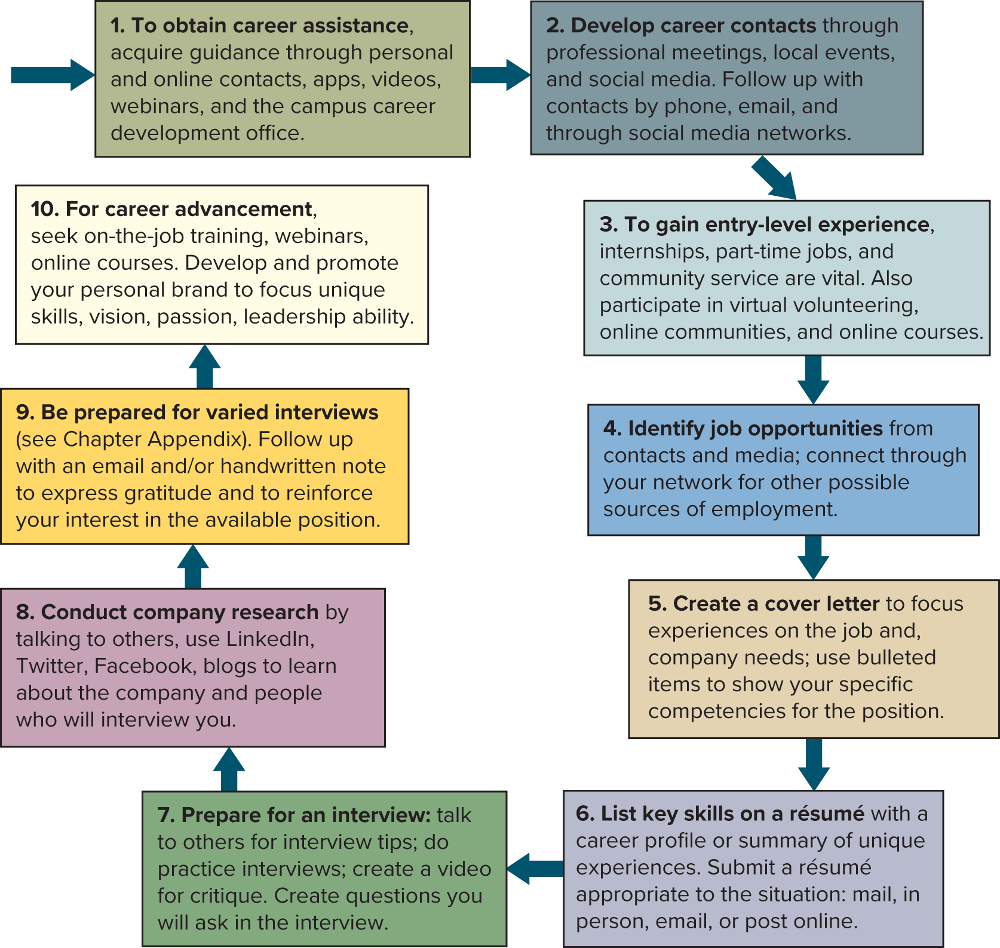

To communicate online, you can:
* Get on LinkedIn
* Maintain a professional image
* Use keyworks that describe your skills in your industry
* Don't post your resume online arbitrarily
* Follow-up with regular contacts
* Don't join online groups that are not professional/you won't participate in 
* Create a blog

Career fairs can help, which allow you to quickly communicate your potential contributions to an organization. 

Employment agencies match job hunters with prospective employers. These are for profit, so be careful. Also be aware of government-supported employment agencies.

Note that you can also employ **job creation** - developing an employment position that matches your skills with the needs of an organization.

To apply for employment, it involves 3 main elements:
1. **Resume**: a summary of education, training, experience, and qualifications for employers
1. **Cover Letter**: a letter that accompanies a resume, introducing the applicant to a prospective employer
1. **Interview**: formal meeting to discuss a job candidate's qualifications.

### LO2-4: Financial and Legal Aspects of Employment

When accepting a position, do additional research about duties and expectations and other factors:

1. The work environment - _corporate culture_ refers to management styles, work intensity, dress codes, and social interactions in an organization. 
1. Factors affecting salary - to improve your value and enhance salary potential, ask your supervisor for development suggestions, obtain training, expand duties, exceed expectations, and talk with co-workers to contribute to organizational success. 

    To negotiate salary, you should: 
    1. Research comparable positions 
    1. Prepare evidence of your contributions
    1. Plan the appropriate time and message for your meeting w/the supervisor
    1. Emphasize the value of your work for your employer. 

1. Meeting employee needs - non-salary benefits are incredibly important in companies. this includes child care, elder care, and other things that care for varied life situations. **flexible employee benefit programs** (cafeteria-style benefits) allow workers to base job benefits based on a credit system and personal needs. Others have _flexible spending plans_ otherwise known as _expense reimbursement accounts_ where you set aside some of your salary to pay for medical expenses that are not subject to income/social security tax. Others offer a _medical-savings account_ (MSA) or a _health savings account_ (HSA) to enable account holders to pay health care costs with pretax dollars. 

Some employers offer a retirement plan, such as a 401(k) or for nonprofits, 403(b). All qualified plans must be 100% vested on completion of 5 years of service or (2) have 20% vesting after 3 years and full vesting in stages after 7 years. 

To compare benefits, there are 2 methods:
1. _Market value_: monetary value of an employee benefit, the cost if you had to pay it to them.
1. _Future value calculations_: assess the long-term worth of employee benefits like a retirement plan.

You should also consider a _tax-exempt_ benefit so that you don't have to pay income tax, or _tax deferred_ benefits where you pay income tax at the time of retirement. To calculate tax-equivalent employee benefits:

$$\frac{\text{Value of the benefit}}{1 - \text{tax rate}}$$

YOu can also calculate the _after tax value_ of an employee benefit with $\text{taxable value of the benefit} (1- \text{Tax rate})$. 

Make sure you are aware of your employment rights. For example, you cannot be refused to be hired because you're a pregnant woman or have a disability. You cannot be discriminated against on age, race, color, religion, sex, etc. Minimum-wage and overtime pay legislation apply to individuals in certain work settings. Worker's compensation like Social Security and unemployment insurance are required. 

### LO2-5: Long-Term Career Development

Every day you take actions that contribute to career success. This can include:
* Working well with others
* Flexibility and openness
* Developing efficient work habits
* Learning to anticipate problems and solve them creatively

Training Opportunities: many careers have formal training methods like programs, seminars, and webinars. Informal methods include reading and discussion with colleagues and online courses. 

Career Paths and Development:

You will likely move through _stages_ of your career. A **mentor** is an experienced employee who serves as a teacher and counselor for less-experienced people in a career field. 

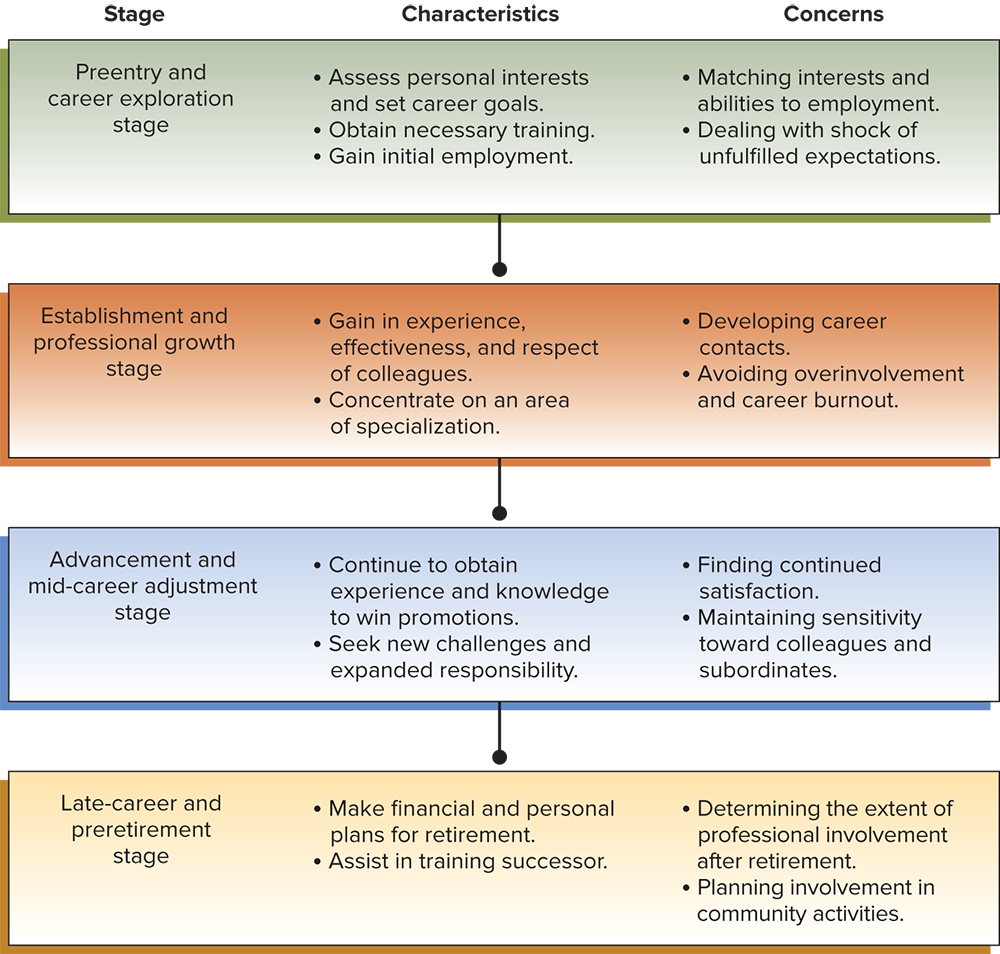

Changing Careers

Changing jobs can be more difficult than selecting your first job. This must include an assessment of financial and personal costs along with benefits based on your goals. 

## [Chapter 1: Personal Finance Basics and the Time Value of Money](https://canvas.its.virginia.edu/courses/74463/assignments/365263?module_item_id=836815)

### LO1-1: The Financial Planning Process

Both financial and personal satisfaction is a result of an organized process called _personal money management_ or _personal financial planning_. 

Personal financial planning is the process of managing your money to achieve personal economic satisfaction. 

_Financial literacy_ is the use of knowledge and skills for earning, saving, spending and investing money to achieve personal, family, and community goals, which includes developing attitudes, behaviors, and competencies to meet current and future financial obligations. 

Personal financial activities generally fall under three categories: 

1. Spending - daily expenses, activites
1. Saving - for emergencies/long-term security
1. Sharing - for local/global causes

THe financial planning process below is:

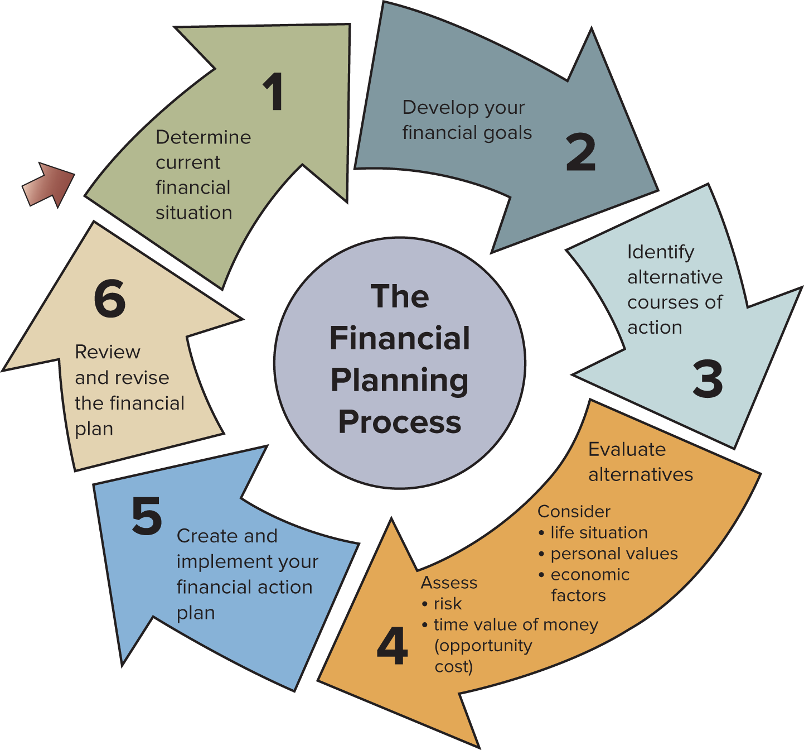

1. Determine your current financial situation
    - Determine your income, savings, living expenses, and debts. Maintaining a record is important. 
1. Develop Financial Goals
    - YOu need to identify how you feel about money and why, and are your feelings based on knowledge or influence? How will the economy affect your goals? 
1. ID Alternative Courses of Action
    - _continue the same action_
    - _expand the current situation_
    - _change the current situation_
    - _take a new course of action_
1. Evaluate your alternatives
    - Evaluate personal values and life situation and the ways in which your financial goals and alternatives match your values and situation.
    - Consequences of Choice: _opportunity cost_ is the cost of passing up the next best choice when making a decision. So you may invest in a stock but not go on a vacation.
    - Evaluating Risk: Identifying risk is difficult but necessary. Risk can include:
        * Inflation Risk - rising/falling prices resulting in a gain/loss of buying power. 
        * Interest Rate Risk - Changing interest rates affect your costs when you borrow/invest. Borrowing at a low interest rate can be to your advantage when rates are rising. 
        * Income Risk - The loss of a job may result from changes in technology. 
        * Personal Risk - This can include health risks, safety risks, and additional costs from financial decisions.
        * Liquidity Risk - The inability to convert assets into cash without a loss in value.
1. Create and Implement your Action Plan
1. Review and Revise your plan

The three main sources of info for financial planning are the media, financial institutions, and financial planners.

### LO1-2: Influences on Personal Financial Planning

An _ecosystem_ is a network of activities and interconnections. Elements of the personal finance ecosystem include life situation, personal values, the financial system, and economic factors.

Life situation and Personal Values

- Life situation/lifestyle changes from several factors. the **adult life cycle** - the stages in the family situation and financial needs of an adult - influences decisions. In addition, your **values** - the ideals and principles you consider important/desireable influence what you spend money on. 

- The Financial System/Economic Factors: money in the economy flows from providers of funds to users of funds through intermediaries and markets. 
    * a _security_ is a financial instrument that represents debt or equity.
    * _debt securities_ (such as bonds) represent money borrowed by companies or governments.
    * _equity securities_ (such as stocks) represent ownership in a company.
    * _economics_ is the study of how wealth is created and distributed.
    * _The Fed_ is the Federal Reserve System which is the central bank of the US that maintains the money supply, regulates financial institutions, and controls the availability of credit.

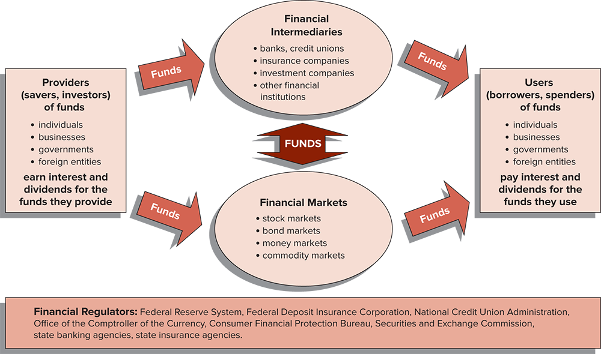

- Global Influences: The global economy can affect our personal finances. It is affected by foreign investors and competition in markets. For example, when the value of US made goods is loiter than imported goods, more US dollars leave the country than the amount of foreign currency coming in. This is called a _trade deficit_. Some try to impose _tariffs_ to counteract this. 

- Economic COnditions

Economic conditions that influence personal finance are:

|Economic Factor| What it Measures| How it influences Financial Planning|
|---|---|---|
Consumer Prices | the buying power of the dollar, inflation | if prices rise faster than income you can't purchase the same amount of goods/services.
Consumer Spending | the demand for goods and services by individuals and households | Increased consumer spending usually creates more jobs/wages, high levels of consumer spending may push up interest rates/prices. 
Interest Rates | the cost of money - the cost of credit when you borrow; the return on money when you save or invest | High interest rates make buying on credit more expensive; higher interest rates make saving and investing more attractive and may discourage borrowing
Money Supply | The dollars available for people to spend | Interest rates tend to decline as more people save and invest, but higher saving may also reduce job opportunities. 
Unemployment | The number of people without jibs who are also willing to work | Unemployed people should reduce spending and may need to access their emergency fund, high unemployment may reduce consumer spending and job opps. 
Housing starts | the number of new homes being built | Increasing home building creates jobs, higher wages, more spending, and economic expansion. 
GDP | Total value of goods and services produced within a country's borders | Measures economic viability of a country resulting in jobs and opportunities for increased personal wealth
Trade balance | difference between exports and imports | If exports > imports, the balance of trade deficit is favorable. If imports > exports, the balance of trade deficit is unfavorable.
DJA, S&P 500, NASDAQ  | the relative value of stocks represented by the index | indicate general movement of stock prices. 

- Consumer Prices - _inflation_ is the general rise in prices. _deflation_ is the general decrease in prices. _disinflation_ is the general slowing of price increases. Inflation is caused by an increase in demand without an increase in supply. It is harmful to people on fixed incomes. It can also affect lenders of money. For example, if you pay 4% interest on a loan and the inflation rate is 6%, the dollars you pay the lender have lost buying power; the lender is losing money.
    * Rule of 72: to determine how long it will take for prices to double, divide 72 by the inflation rate.

- _CPI_ - Consumer Price Index - measures the change in prices of goods/services over time. It is used to measure inflation on a market basket of goods. 

- Interest Rates - the cost of money. WHen consimer saving and investing increase the supply of money, interest rates tend to decline. When consumer spending increases, the demand for money increases and interest rates tend to rise.

### LO1-3: Developing Personal Financial Goals

There are two major factors that change your financial plans - the time frame in which you want to achieve your goals, and the financial need that drives your goals.

- Timing: 
    1. Short Term Goals - vacation, small debts, something within a year. 
    1. Intermediate Goals - 1-5 years.a
    1. Long Term Goals - 5+ years, such a retirement, funding education, a home. 

Within timing, you need to have some goal-setting guidelines. You can take the "SMART" Approach - 
    - S: Specific
    - M: Measurable
    - A: Action-Oriented
    - R: Realistic
    - T: Time-Based

### LO1-4: Opportunity Costs and the Time Value of Money

Opportunity cost is the cost of passing up the next best choice when making a decision.

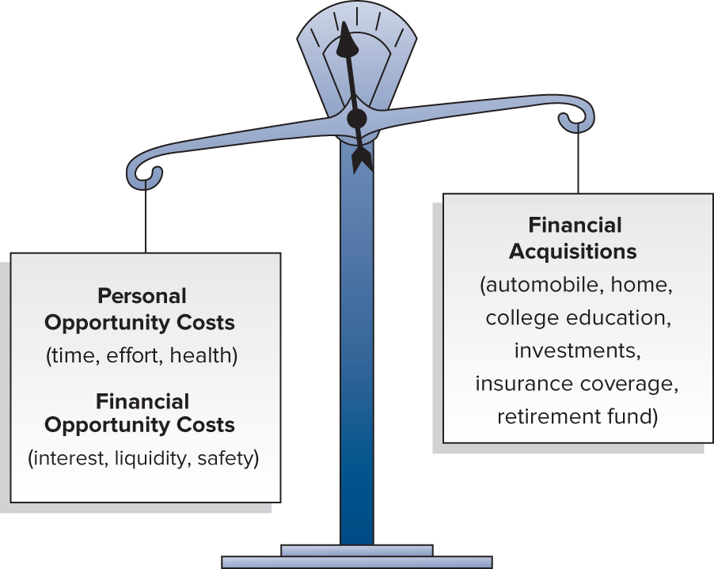

- Personal Opportunity Costs: A valuable personal opp cost involves time. This can include time spent on a job, time spent on leisure activities, and time spent on personal finance activities. And it can also include physical habits. 
- Financial Opportunity Costs: The _time value of money_ evaluates increases in an amount of money as a result of interest earned. 
- Interest Calculations: Three amounts are required to calculate the time value of money: 
    1. The amount of money invested or borrowed
    1. The interest rate
    1. The length of time the money is invested or borrowed.

- 5 Methods to calculate time value of money:
    1. _Formula Calculation_: Image above
    1. _time Value of money tables_
    1. _Financial Calculator_
    1. _Spreadsheet_
    1. _Websites/Apps_

**see ch1 appendix for information on all of these formulas**

- Future value of a single amount: _future value_ is the amount to which current savings will grow based on a certain interest rate and a certain time period. The formula is $FV = PV(1 + i)^n$ where FV is the future value, PV is the present value, i is the interest rate, and n is the number of periods.
- Future value of a series of deposits: _annuity_ is a series of equal deposits at equal intervals. The formula is $FV = PV \times \frac{(1 + i)^n - 1}{i}$ where FV is the future value, PMT is the amount of each payment, i is the interest rate, and n is the number of periods.
- Present value of a series of payments: $PV = Annuity * \frac{1 - \frac{1}{(1 + i)^n}}{i}$ where PV is the present value, Annuity is the amount of each payment, i is the interest rate, and n is the number of periods.
- Yearly earnings based on savings and annual interest rate: $Earnings = PV \times i$ where Earnings is the yearly earnings, PV is the present value, and i is the interest rate.
- Rate of increase: calculate the difference between future and present value and divide by the present value.
- Future Value of a series of deposits: an _annuity_ is a series of equal deposits/payments. 
- Present value of a single amount: _present value_ is the current value for a future amount based on a particular interest rate for a certain period of time. 
- Present value of a series of deposits:  calculations that can be used to determine how much you need to deposit now so that you can withdrawal a certain amount for a set number of years. 

### Achieving Financial Goals

- Components of Personal Financial Planning

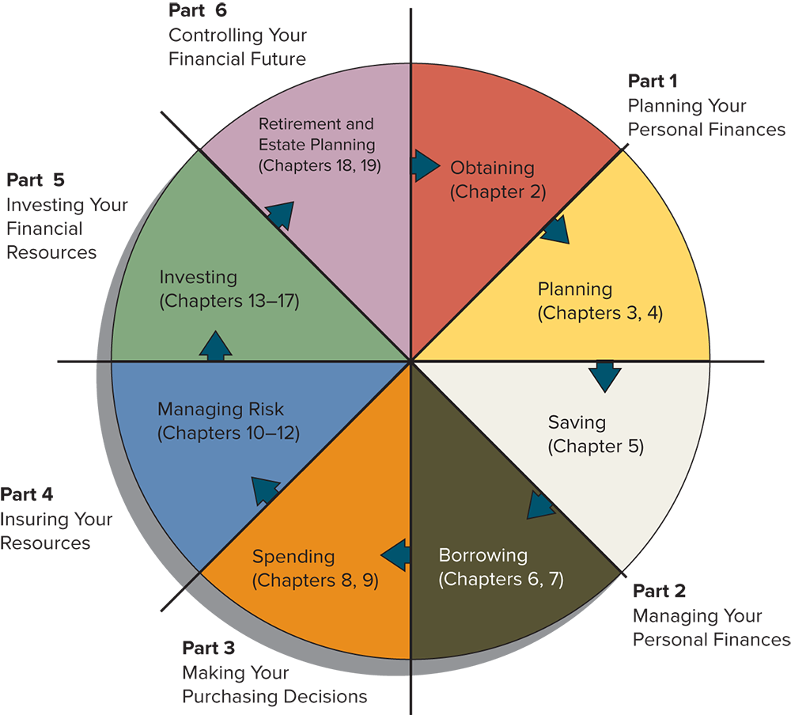

1. Obtaining (Ch2) - financial resources are the foundation of planning.
1. Planning (Ch3, 4) - Planned spending is the key to achieving goals. 
1. Saving (Ch5) - Long-term financial security starts with regular saving. Some savings must be able to be _liquid_ to meet needs. 
1. Borrowing (Ch6, 7) - Appropriate credit can contribute to your goals. 
1. Spending (Ch8, 9) - Spending smartly and planned is key. 
1. Managing Risk (Ch10 - 12) - Insurance and other risk management strategies can protect your goals.
1. Investing (Ch13 - 17) - Investing for _current income_ and _long-term growth_ can help you achieve your goals.
1. Reitrement and Estate Planning (Ch18, 19) - Planning for retirement and the transfer of your estate to others is important.

- Financial Plans: a _financial plan_ is a formalized report that summarizes your current financial situation, analyzes your current financial needs, and recommends future financial activities.

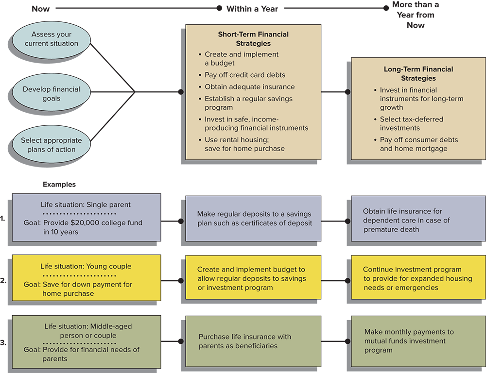

