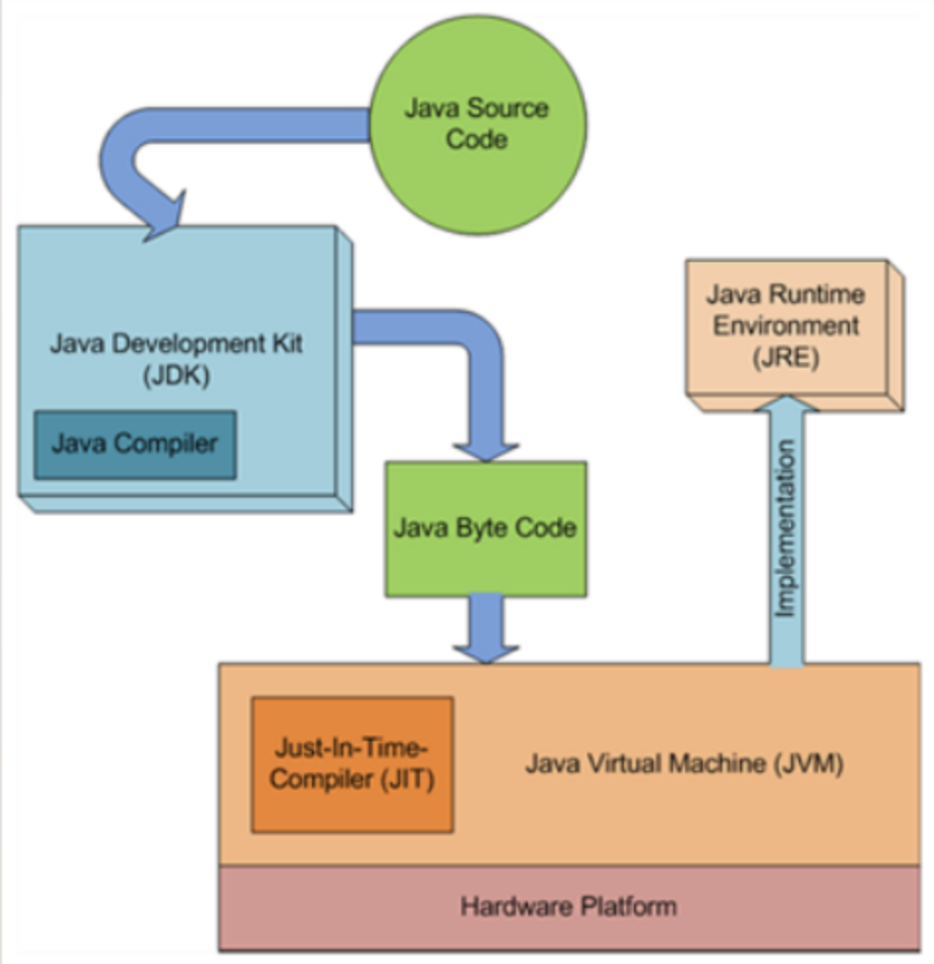

# Lecture 8 - Analyzability, Code Quality, Refactoring ([slides](https://drive.google.com/file/d/1rxvHVGJpBKdXy-nsj9RXuLrw0u1rNGkF/view?usp=drive_link))

## Analyzability

* Other people have to read your code:
    * Teammates, TAs, office hours, etc.
* You will read your code far more times than you will write it
    * You won't remember what you were thinking when you wrote it.

When do we need analyzability? 
* Vital for maintenance:
    * Debugging
    * Program comprehension
    * Concept location
* Every time you:
    * Bug fix
    * Improve/optimize
    * Add new features
* Whenever you do maintenance, you start by reading the code!

### Code Style

* Good style is important:
    * Using consistent style makes code easier to read
    * Repeating similar patterns means learning one part of a codebase prepares you for other parts
* Even a "bad" code style, if consistent, is better than no style at all
    * I'd rather be on a team that does something I don't like as a rule than a team with no rules
* However, no code style leads to some useless debates. 

### Readability vs. Understandability

* Readability: 
    * The ease that readers can identify and different tokens and their _syntactic_ meaning
    * Understands the mechanics of the code
* Understandability:
    * The ease with which a reader can identify the _semantic_ meaning of the code.
    * Understand why the code exists, what it does, etc. 

#### Readability

* Readability refers to how easy it is to derive the syntactic meaning from code
* What affects readability:
    * Whitespace usage
    * identifier length
    * Use of dictionary words
    * Variable between identifiers (i.e. appleCount vs. applesCount)


#### Understandability

* Readability is necessary, but _insufficient_ requirement for understandable code. 
    * Readable code is not necessarily understandable. 
* Understandability can be improved by:
    * Meaningful identifier names
    * comments and documentation can help but aren't a substitute for understandable code.
    * Adhere to naming conventions, i.e. `CONSTANT_VARIABLE` or `camelCase`. 

#### Conventions

* Avoid single-letter variable names
    * Only use stuff like i and j in a for loop, but nowhere else. 
* Variable names should be:
    * camelCase - never capitalize a variable, or it will look a class name
    * Exception - PROGRAM_CONSTANTS - all capitalized, underscores between words
* Focus on communicating **high level intent**
* Avoid jargon when possible, abbreviate
* Units in variable names - `distanceFeet` is better than `distance`

#### Informative Comments

* Comments shouldn't explain how code works, the code should explain itself. Comments should exist on code for stuff like regex or other things that cannot be easily understood.

#### Obstacles to Understandability

* Complexity:
    * Keep functions shorter by extracting sub-methods
        * decompose long functions into chains of shorter functions
    * try to make code readable rather than "clever." 
* Structural
    * the number of paths through code shouldn't be too large
        * Try to avoid nesting loops by using method extraction
        * When possible, limit nested if statements
* Number of identifiers
    * Too many identifiers can be confusing

#### Rules for Writing Functions

* Functions should be small
    * Functions are good at doing one thing, bad at doing multiple things.
* Functions should do one thing, well, and only!
* 


# Lecture 7 - Exceptions & Defensive Programming (no slides, see example code)

## Testing Types

Example: Consider a function called `nextDay` that takes in an `int year`, `int month` and `int day` and returns an `int[]` of the next day. 

1. Equivalence - "this is a usual test case. basic operations."
    * `nextDay(2023, 9, 12)` -> `[2023, 9, 13]`
1. Boundary - 
    * `nextDay(2023, 9, 30)` -> `[2023, 10, 1]`
    * Leap year
    * new year
1. Exception
    * `nextDay(2023, 9, 31)` -> `IllegalArgumentException`


### Exceptions

Exceptions mean "exceptional event." 
* That is, our program cannot handle a certain condition, and so an exception is thrown
* Exception must either be handled or the program crashes.

Ex:
* `Integer.parseInt("Five") -> NumberFormatException`

### Checked vs. Unchecked Exceptions

* Checked - compiler forces you to handle the exception. These exceptions happen when you're fetching data from external sources.
    * Ex: `FileNotFound`, `IOException`
    * Don't just make the method `throws Exception` - that's lazy and bad practice, and requires you to make the caller of that method handle the exception which could cascade into a lot of `throws Exception` statements for the caller if you're layers deep.
* Unchecked - compiler does not force you to handle the exception. 
    * Ex: `IllegalArgumentException`, `NullPointerException`


# Lecture 6 - Test Plans & Strategies ([slides](https://drive.google.com/file/d/1AdOHBPjC0IlxoXd5y1r9Hi6BG4gz4uDw/view?usp=drive_link))

## Announcements

HW1
* Part 1 - due monday 9/11
* Part 2 - release Tuesday, 9/12 morning, due 9/18. Same groups/repos for part 2
* Quiz 3  -due wednesday 9/13 covers content from lecture today/readings

## Test Plans

### Aside

Note that if you have multiple assert statements in a test, if the first one fails, it won't run the rest of the test. So that is why you can add the optional `message` string argument in `assertEquals` - to tell you which test failed if you have multiple assertions in a test. 

Consider the [Vote Tally](class-examples/06-testing-plans/VoteTally.java) class stored at `class-examples/06-testing-plans/VoteTally.java`. 

With the test for `addVotes_existingCandidates` in the accompanying test class, you can create a `protected` constructor in `VoteTally.java` which directly injects state into the field. Protected - public to everything inside of the same package, private otherwise. Thus, it's great for testing! That way we don't have to do multiple `testVoteTally.addVotes()` calls, but we can just do one. 

```java
    protected VoteTally(Map<String, Integer> candidateVotes) {
        this.candidateVotes = candidateVotes;
    }
```

So now our test can be:

```java
    @Test
    void addVotes_existingCandidates() {
        var testVoteTally = new VoteTally(new HashMap<>(
                Map.of("John Smith", 20, "Votey McVoteface", 10))); // make a new HashMap since Map.of is immutable

        // now you're only calling addVotes once! And the test is still the same!
        testVoteTally.addVotes(Map.of("John Smith", 10, "Jane Doe", 15));

        assertEquals(3, testVoteTally.getNumCandidates());
        assertTrue(testVoteTally.getCandidates().contains("John Smith"));
        assertTrue(testVoteTally.getCandidates().contains("Jane Doe"));
        assertTrue(testVoteTally.getCandidates().contains("Votey McVoteface"));
        assertEquals(30, testVoteTally.getVotesForCandidate("John Smith"));
        assertEquals(15, testVoteTally.getVotesForCandidate("Jane Doe"));
        assertEquals(10, testVoteTally.getVotesForCandidate("Votey McVoteface"));

    }
```

### Assert Functions

In addition to assertEquals, there are:
* `assertTrue` - pass iff is true
* `assertFalse` - pass iff is false
* `assertArrayEquals` - passes if arrays are same size and expected[i].equals(actual[i]) for all i
* `assertNull` - pass iff value is null
* `assertNotNull` - fail iff is not null
* `fail()` - automatically fails the test. 
* With object classes, assertEquals uses the object `.equals()` method. 

### AssertEquals with Doubles

Doubles in Java are imprecise. As such, assertEquals functions with java take in an additional "tolerance" argument. If the expected and actual values are within the tolerance it's considered true. This optional "tolerance" argument is also true in `assertArrayEquals` with a `double[]`.

### How many Tests is Enough? 

If you are testing something like "is _x_ a leap year on the gregorian calendar?" you can test every year from 1582 to 2400. However, this is not feasible for most programs.
* If we test 2024, do we need to test 2028? - **no**
* If we test 2100, do we need to test 2200? - **no**
* If we test 2000, do we need to test 2400? - **yes**

- Note this is "black box testing" - given an _interface_, we design test cases to test the _functionality_ of the interface.

### Test Plan Strategies

- A test plan is a set of tests to search for bugs
- TDD - is the process of writing tests before writing code. This relies on writing tests based on specification. **"Red, green, refactor"**
    * Red - write a test that fails
    * Green - write enough code to make the test pass
    * Refactor - clean up the code
    * Advantages:
        - Unit tests demonstrate clearly that a function behaves as intended
        - able to rapidly test bugs
        - encourages highly-cohesive, loosely-coupled code (good thing)
        - Demonstrated to significantly reduce debugging time. 

### Testing Strategies

1. Black Box Testing - selects tests considering the specification and interface of a module. 
    * Focus on the interface, not the implementation
    * NOt just _arguments_ and _return_ values, also _state_
1. White Box testing - selects tests using understanding structure and details of the code of a module
    * Focuses on implementation

### Code Coverage

1. Statement Coverage - what % of statements executed by test
1. Condition Coverage - Have all boolean variables/expressions been both true/false in at least one test? 
1. Branch Coverage - for every if, do we evaluate both enter and skip/else? For every switch, do we evaluate every case? For every loop, do we evaluate normal iteration, one pass, zero pass? 
1. Path Coverage - for every path through the code, do we have a test that executes that path?

We want to maximize code coverage. However, it is not feasible toe expect 100% converge across all measures. We can avoid things like trivial getters and setters that have no logic (aka auto-generated getters and setters).

### Code Refactoring Example

let's refactor this:

```java
	public double calculateBill(int coursesTaken) {
		double total = 0;
		if (coursesTaken < 3) {
			total = 8000 * coursesTaken;
		} else if (coursesTaken >= 3 && coursesTaken <= 6) {
			total = 6000 * coursesTaken;
		} else {
			total = 5500 * coursesTaken;
		}
		if (amountOverdue <= 2000 && isInterestExempt) {
			return total + amountOverdue;
		} else if (amountOverdue > 2000) {
			if (isInterestExempt) {
				return amountOverdue * 1.1 + total;
			} else {
				return (total + amountOverdue) * 1.1;
			}
		} else {
			return total + amountOverdue * 1.1;
		}
	}
```

* Let's turn the first `if` statement block into a new function called `getTotal(int coursesTaken)` (a static method not reliant on fields).
* Let's clean the second `if` statement block:

```java
var overdueBill = amountOverdue;
if (!interestExempt) {
    overdueBill *= 1.1;
}
return total + overdueBill

```

Now let's see this refactoring in action:

```java
public double calculateBill(int coursesTaken) {
    double total = getTotal(coursesTaken); // you can do this automatically by doing "refactor -> extract -> method" 
    if (amountOverdue > 2000) {
        total *= 1.1;
    }
    var overdueBill = amountOverdue;
    if (!interestExempt) {
        overdueBill *= 1.1;
    }
    return total + overdueBill;
}
```

So much more readable and understandable! And most importantly, **testable** and **debuggable**. 


# Lecture 5 - V&V and Testing ([slides](https://drive.google.com/file/d/17I6eKfAXFvfu7JEgxyhkwNywusNeMEX-/view?usp=drive_link))

## Verification and Validation

Verification:
- Evaluating a system or a component to determine whether products of a given development phase satisfy the conditions imposed at the start of the phase
    * "Did we build the thing right?"
- Validation: 
    * Evaluating a system or component during or at the end of the development process to determine whether it satisfies specified requirements. 

## Testing Software

- You will never be certain that your code is correct
- Even trivial software systems can have theoretical inputs, states, etc. 
    * Conventionally a finite number, but a finite number that is too big to practically constrain
- You cannot test all possible inputs, states, etc.

## Software Testing Cannot Prove Code Works

* Software testing - **_executing_ a piece of software with the intention of _finding_ defects/faults/bugs**.

## Software Testing

- The mindset of a tester should be to **find bugs**, not to prove the system works.
- Testing typically involves executing a portion of the program in a series of controlled state:
    - Expected output
    - Actual output
- Programs can pass verification but fail validation (can pass tests but it's not what the customer wants)

## Unit testing

```java
public static int max(int a, int b, int c) {
    if (a > b) {
        if (a > c) { return a; }
        else { return c; }
    } else {
        if (b > c) { return b; }
        else { return a; } // bug, this should be c
    }
}
```

```java
public static int max(int a, int b) {
    return (a + b + Math.abs(a - b)) / 2; // works, but integer overflow!
}
```

You cannot look at code and find bugs. No matter how hard, you will miss obvious bugs. Thus, we need help finding bugs. **Test** the code to find bugs!!

## Important Quote

- Program testing can effectively show the presence of bugs, but it is hopeless for showing their _absence_. 
- We test to _find_ bugs. Testing allows us to reduce (but not remove) _uncertainty_.

## Testing Scenarios

Has three things:
1. Input
    - function params
1. Expected output
    - what the function should return
1. Actual output
    - what the function actually returns

## Testing Errors

- Be careful constructing your expected output. If your expected output is incorrect, your test will be useles and misleading.
- Make sure tests are **sound** first!!

## Junit

- Create a class in the `test/java` folder, generally make the class name that you're testing `[x]Test`

```java
import org.junit.jupiter.api.Test;

import static org.junit.jupiter.api.Assertions.*;

public class MathFunctionsTest {

    @Test
    void max_3arg_descending() {
        // assertEquals(expected, actual)
        assertEquals(3, MathFunctions.max(3, 2, 1)); // this is a static function btw
    }

    @Test 
    void max_3arg_ascending() {
        assertEquals(3, MathFunctions.max(1, 2, 3));
    }

    @Test
    void max_3arg_middle() {
        assertEquals(3, MathFunctions.max(1, 3, 2));
    }

}

```

## Testing Classes with JUnit

Consider the class `NumberChanges`:

```java
/**
 * This class tracks a number as well as how many times that number has changed.
 */

public class NumberChanges {
    private int number;
    private int timesChanged;

    /**
     * Constructor where the initial value of the number is specified
     */
    public NumberChanges(int initialNumber) {
        this.number = initialNumber;
        this.timesChanged = 0;
    }

    /**
     * Constructor where the initial value of the number defaults to 0
     */
    public NumberChanges() {
        this(0);
    }

    /**
     * Returns the value of number
     */
    public int getNumber() {
        return number;
    }

    /**
     * Returns the number of times the number has been changed
     */
    public int getTimesChanged() {
        return timesChanged;
    }

    /**
     * Sets the value of number. If the value of newNumber value is different from before,
     * this increments the number of times the number has changed.
     */
    public void setNumber(int newNumber) {
        if (newNumber == number) {
            return;
        }
        number = newNumber;
        timesChanged++;
    }
}

```
Mow consider NumberChanges test!!
```java

import org.junit.jupiter.api.Test;

class NumberChangesTest {

    // constructor testing
    @Test
    void constructor() {
        var testNumberChanges = new NumberChanges(5);

        assertEquals(5, testNumberChanges.getNumber());
        assertEquals(0, testNumberChanges.getTimesChanged());
    }

    @Test
    void setNumber_differentNumber() {
        var testNumberChanges = new NumberChanges(5);

        testNumberChanges.setNumber(7);

        // now use getters to check the fields!
        assertEquals(7, testNumberChanges.getNumber());

        // check that timesChanged was incremented
        assertEquals(1, testNumberChanges.getTimesChanged());
    }

    @Test void setNumber_sameNumber() {
        var testNumberChanges = new NumberChanges(5);

        testNumberChanges.setNumber(5);

        // now use getters to check the fields!
        assertEquals(5, testNumberChanges.getNumber());

        // check that timesChanged was incremented
        assertEquals(0, testNumberChanges.getTimesChanged());
    }

}

```


# Lecture 4 - Build Tools ([slides](https://drive.google.com/file/d/1BDfFJ6DUbSitbJ-ttXCW3foW5hpuN0NK/view?usp=drive_link))

## Gradle

Think about everything you have to do to get to stat on HW1 w/o a build tool:
1. Everyone has to clone the repo
1. Everyone has to share the same version of Java
1. Everyone has to set up their IDE the same
1. Everyone has to use the same libraries

Gradle is a build tool and an automation tool that can:
* Automatically download all libraries including the correct version number
* Automate build process

### Gradle File Organization (using NBATeams Example):

This is how gradle expects the files to be organized! If you create a new project in IntelliJ, it does this, and so does GitHub classroom. All of your code is in `src`.
* The code that "runs" is within `main/java`
* the code in `test/java` is for testing

```
src
    main
        java
            edu.virginia.cs.somePackage
                Main.java
        resources
            teams.json
    test
        java
            edu.virginia.cs.somePackage
                MainTest.java
build 
    classes
    generated
    libs
        NBA-Excel-1.1.jar
    reports
        tests
            test
                classes
                css
                js
                packages
                index.html // open this to see test results
    test-results
    tmp
build.gradle // this is the build file
gradlew // leave this alone, it's a wrapper that runs gradle
.gitignore


```

#### Build.gradle

Follow along with this example [here](https://github.com/sde-coursepack/NBAExcelTeams.git) which is also in `class-examples/NBAExcelTeams`

Note that gradle will not re-compile if the `.class` files are already there. This is great for great for incremental development and very large projects - you only recompile things that were changed. 


```groovy
plugins {
    id 'java'
}

jar {
    // this is the base name of the jar file, so it will be NBA-Excel.jar. It will add the version number and the extension automatically
    archivesBaseName = "NBA-Excel"
    duplicatesStrategy = DuplicatesStrategy.EXCLUDE
    manifest {
        // aka: "when i run the `.jar`, run this class"
        attributes "Main-class": "edu.virginia.cs.nbateams.Main"
    }

    from {
        configurations.runtimeClasspath.collect { it.isDirectory() ? it : zipTree(it) }
    }
}

group 'edu.virginia.cs.nbateams'
version '1.1'

repositories {
    mavenCentral()
}

// specifies dependencies that will be used in the project
dependencies {
    implementation group: 'org.json', name: 'json', version: '20220320'

    implementation group: 'org.apache.poi', name: 'poi-ooxml', version: '5.2.2'
    // used in runtime, not actually compiled. This is becuase POI uses log4j, which is a logging library that is used by POI but we won't use
    runtimeOnly group: 'org.apache.logging.log4j', name: 'log4j-core', version: '2.18.0'

    testImplementation group: 'org.mockito', name: 'mockito-core', version: '4.7.0'
    testImplementation 'org.junit.jupiter:junit-jupiter-api:5.9.0'
    testRuntimeOnly 'org.junit.jupiter:junit-jupiter-engine:5.9.0'
}

// If you want to test, you can do `./gradlew test`
test {
    useJUnitPlatform()
}
```

### When to use libraries

- If you need to do something complicated, like read/write excel files, use a library. 
- For example, if you want to read a `.xlxs` file, you can use the `apache-poi` library.

```java
public class Main {
    public static void main(String[] args) {
        var workbook = new XSSFWorkbook("filename.xlsx");
        var sheet = workbook.getSheetAt(0);
        var rowIterator = sheet.rowIterator();
        var catList = new ArrayList<Cat>();
        rowIterator.next(); // skip the header row
        while (rowIterator.hasNext()) {
            var row = rowIterator.next();
            var name = row.getCell(0).getStringCellValue();
            var age = (int) row.getCell(1).getNumericCellValue();
            var furPattern = row.getCell(2).getStringCellValue();
            var rating = row.getCell(3).getNumericCellValue();
            var newCat = new Cat(name, age, furPattern, rating);
            catList.add(newCat)
        }

        // cat comparator
        Collections.sort(catList, (a, b) -> Double.compare(b.getRating(), a.getRating()))
        // #javaScriptBetter lmao 

        // print catList
        catList.forEach(System.out::println); // ok this is kinda cool beuase in js you'd have to do catList.forEach(cat => console.log(cat)) which is still pretty clean lol
    }
}
```


# Lecture 3 - VCS - ([slides](slides/03%20Version%20Control%20+%20Git.pdf))

## Reminders

Homework 1 - Submit groups on Sept 1 at 11:59 PM, assignment 1 due September 8th at 11:59 PM

### Iterative vs. Incremental

Incremental - implementing "blocked" stages. This means that almost every stage of the project has been planned out. 
Iterative - Starting with an idea, and then building on it.

### Version Control

Version control tracks multiple file version, allowing multiple version of software to exist simultaneously and recovering old ones. 

It is now a mainstay in SDE, `git` being the most popular. 

### Git vs. SVN

For a centralized version control system like SVN, you have a central server that stores all the files. You can check out a copy of the files, make changes, and then commit them back to the server. The problem with this is that every commit will be seen by everyone, so it made people hesitant to commit

For `git`, each workstation has a local repository and a working copy that you can then commit/update to, and then pull/push to the remote repository. This supported the idea of "commit early and often" 

### Why VC? 

- Backup
- Bug Fixing: you can "backtrack" commits to find here the bug was introduced. 
- Collaboration: multiple devs can work together. Branching allows features to be added and developed independently. 
- Deployment: You can deploy different versions of the software to different servers, AKA CI/CD.
- Conflict: Humans decide how to resolve conflicts, not the computer.
- Regression testing: As you add tests for features you're adding, you can run them to make sure you didn't break anything.

### `git` cli

- `git init` - initialize a git repository
- `git add filename` - add files to the staging area
- `git commit -m "message"` - commit the files in the staging area to the _local_ repository. 
- `git push` - push the local repository to the remote repository
- `git branch branchname` - create a new branch
- `git switch branchname` - switch to a different branch
- `git checkout branchname` - switch to a different branch
    * you can also checkout to a specific commit with `git checkout commitid`
- `git merge branchname` - merge the branch into the current branch
- `git pull` - pull the remote repository to the local repository
- `git status` - show the status of the repository
- `git log` - show the commit history
- `git push -u origin branchname` - push the branch to the remote repository

Note that `HEAD` is the most recent commit. 


# Lecture 2 ([slides](slides/02%20Java%20Introduction%20Command%20Lines.pdf))

The hard part isn't coding:

- Understanding complicated, human-executed process. 
- Decompose it into individual steps. 
- Translate those steps into things a computer can do.

The entire point of design is taking a complicated general idea and turning it into specific, actionable, **repeatable** steps. 

## What will happen during your project

1. You will have a bug, and you don't know where it is.
1. You don't know how to fix it
1. YOu will go to TA office hours
1. You will go to prof office hours

This won't work becuase we can't understand the _scope_ of the code. It's too bug, complicated, and has several interacting parts. We cannot understand your entire _code base_ at one time. 

### Incrementalization

1. Being a good engineer doesn't mean:
    - Being a great programmer
    - knowing all the popular programming languages/frameworks/technologies
1. These are valuable but not the primary goals of SE:
    - You need to learn to use a hammer and a chisel to build a masterpiece sculpture
    - However, learning how to use a hammer and a chisel doesn't make you Michelangelo. 

### How Code Works

In C. you write a program in a `.c` file. You compile it with `gcc` and it produces an executable file. 

```bash
gcc -o hello hello.c
```

The problem is that it works on your operating system and hardware but not on others. This machine code is designed to interface with our hardware. 

### Interpretation vs Compilation

Interpretation generates machine code instructions during runtime. This means that you have to _install python_. However, you don't need to install `gcc` to run a compiled C program. 

### Java 


HelloWho.java

```java
public class HelloWho {
    public static void main(String[] args) {
        System.out.printf("Hello, %s", args[0]); // f string 
    }
}
```

You can compile this with `javac HelloWho.java` and run the `.class` file with `java HelloWho argument`.

- JRE: Java Runtime Environment: Abstract computing machine that is used to execute `.class` files.
- JVM: An implementation of a JRE, which interfaces with the underlying operating system, hardware, etc. 
- JIT: Just In Time Compiler: JIT is a part of the JVM, translates instruction sets of the JVM to instruction sets of the CPU. 



See example in the August24 Project in IntelliJ. 


# Lecture 1

## Contact Info

Email: mcburney@virginia.edu - include [SDE] in the subject line

Office: 404 Rice Hall - OH Posted Soon

[Course Website](http://cs3140.com)

[Online Coursepack](http://sde-course.com/)

[Drive Link](https://drive.google.com/drive/folders/1rbif6FPelWVSoHCNLPmysHPuhl5iNlhs?usp=sharing)

## We will do

- SDE Practices:
    - Incremental development
    - Understandable code
- Design
    - Software that is responsive to change and 
    - resistant to entropy
- Front-to-back software with database backends and GUI frontend.


