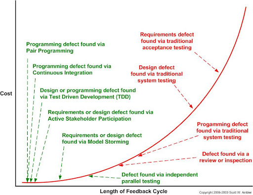
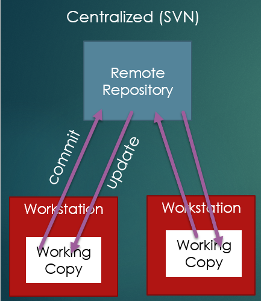
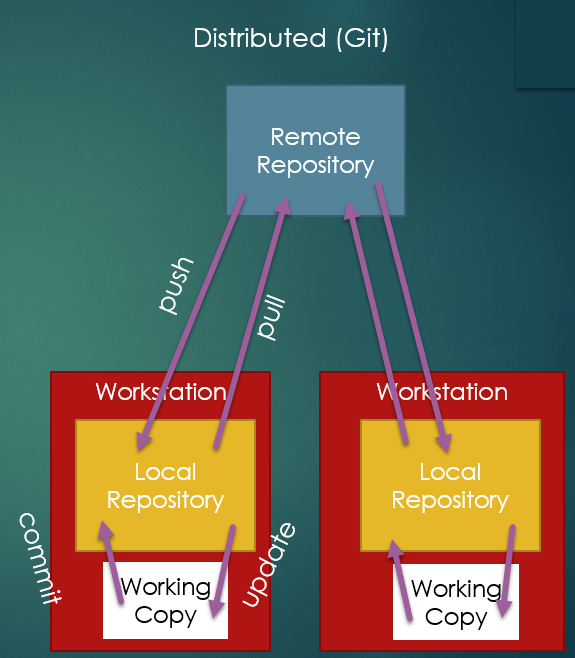

# Reading Notes

## Reading 07 - 

## Reading 06 - Testing([reading](https://sde-coursepack.github.io/modules/testing/Test-Plans/))

### Test Plans

A colleciton of tests is a **test plan** and is necessary to ensure that you are testing all the features of your software. There is _no perfect number_ of tests to write, but we want to use a systematic approach to write _enough_ tests to ensure that our software is working as expected.

#### Types of Tests

Consider the class `MySortedList` with functions `get(int index)`, `add(int value)`, `contains(Object target)`. 

1. Equivalence Tests - shows how the software behaves under normal, predictable conditions
1. Boundary - shows how the software behaves at the boundaries of the specification
1. Exception - test cases that cannot be meaningfully executed correctly ands should throw exceptions.
1. Robustness - cases that are **syntactically valid** but **semantically meaningless**. 

#### How many do i need? 

* We want to test our code thoroughly enough so that we are justifiably confident in its correctness.
* We don't want to **test for the sake of testing**, because that is a waste of time and resources.

We can't have a perfect test plan, but we can modify it as we go to catch all the things we encounter as we keep working. 

### Black Box Testing

Black box testing is an idea where we test what scenarios to write according to the specification of the modules we are testing (a function). We are testing the _interface_, not the _implementation_. 

Testing Strategies:
1. Equivalence Partitioning - partitioning breaks up something big into something small. For our case, this is breaking up our _equivalence cases_ into groups that largely behave the same. 
    * For example, if we wanted to test the `Math.abs()` function we could partition the inputs into 3 groups:
        1. Positive numbers
        1. Negative numbers
1. Boundary Testing - in our example with `Math.abs()`, this would be testing boundary cases like "0".

### Test Driven Development

Test Driven Development (TDD) is a development process where you write tests before you write the code. 

Process:
1. Write a stub - a stub is a function that does nothing but return a value. 
1. Write your first test!

With TDD, you are supposed to write **one test** at a time, and for each test write just enough code to make the last test pass. 

### White Box Testing

Also known as "glass box testing," **white-box testing** selects tests while considering the existing implementation of the code being tested. THis is different from black-box testing because we are considering the implementation, not just the interface.

With white box testing, we want to consider code _coverage_, that is what percentage of _statements_ have been covered by our tests. 

#### Branch Coverage

Branch coverage is a type of white-box testing that considers the _control flow_ of the code. This means that we want to test all possible paths through the code. So for example, for every `if` statement, test the conditions `true` and `false`, and for every loop we test `enters loop` and `does not enter loop`.

#### Conditional Coverage

While we want to catch every true/false case, we also need to consider cases like `if (a > b && b > 0)`, we need to consider every possible case. 

#### Path Coverage

Path coverage is interested in what percentage of possible paths through our code we have taken. 

### TDD Workflow


## Reading 05 - Testing ([reading](https://sde-coursepack.github.io/modules/testing/V-and-V/))

### V&V - Verification and Validation

V&V allows you know when you are done and how you know when that time comes. 

Verification - "does our code meet our specification?"

Validation - "is the customer satisfied with our product?"

#### Differences

When we discus _verification_, we are focused on the **internal** perspective as developers. This is code quality, ensuring the code does what's expected, etc. On the other hand, _validation_ is primarily external and asks if this is what the customer wanted. 
* **Verification**: Did you build the thing right?
* **Validation**: Did you build the right thing?

#### Defects, Failures, Mistakes, Errors

1. Defect - existing problem according to the software specification in the product that hasn't been discovered yet.
1. Failure - the inability of the software system to perform its function according to the specification.
1. Mistake - human error that causes something incorrect, like a bug or misunderstood customer need.
1. Error - the difference between the current state and the correct state. 



### Testing

**Testing** is executing all or part of a program in a controlled manner to find **defects**.

#### Testing Scenario

A testing scenario is where you create a controlled environment with defined inputs and expected behaviors. A **test passes** when the expected results and actual results match.  The purpose of testing is **TO FIND DEFECTS**.

#### Main Method Testing

For now, we write tests in the main method. Consider:

```java
    public static int max(int a, int b, int c) {
        if (a > b) {
            if (a > c) return a;
            else return c;
        } else {
            if (b > c) return b;
            else return a; // should be return c
        }
    }
```

This function takes in 3 integers, and returns the largest one. 

Also, consider this max function:


```java
public static int max(int a, int b) {
    return (a + b + Math.abs(a-b)) / 2;
}
```

Everything works fine until we reach `Integer.MAX_VALUE` in java, for example, we are trying to do something with the largest number `int x = 2147483647;`. This is where our error happens - if our number is more than half the maximum integer, we cannot represent the number doubled. 

A quick fix is to use `longs` instead of `ints`.

It's important to remmebr why we test - to find defects. Remember - **defects are already there**, and if we don't test properly we won't find the defects.


### Types of Testing

#### Unit Testing

**unit testing** is testing individual modules (typically, individual functions). This allows us to catch "silly bugs" immediately. This is great because it can isolate the bug to a method and reduces the amount of code we need to search through.

#### Integration Testing

Where unit testing is used to verify individual modules are operating well by themselves, **integration testing** is when modules are combined. 

For example, if we are testing a method in a class that requires another class to function, we aren't just testing one class, but that class **within the larger operation that comines the class with another class**.

#### System Testing

System testing involves testing the entire system from the user perspective. They generally follow a script to use a feature/set of features within an application. If a defect is found first within **system testing**, this means that there was a lack of thoroughness in unit/integration testing. 

#### Regression Testing

**Regression testing** is when you re-run tests that have already passed to ensure that they still pass. This is because you could introduce a new bug that breaks a previously working feature. Gradle actually performs integration testing for us using `gradlew test` and `gradlew build`.

#### CI

CI is the practice in Software Dev where your code is merged into/added to a "protected" branch, run against a testing suite, and if it passes, it is merged into the protected branch. This is done automatically, and is a great way to ensure that your code is always passing tests.

GitHub offers GitHub Actions. 

#### External Testing (Customers)

1. Internal Testing - testing by the developers
1. Alpha testing - testing carried out internally by the development organization. 
1. Beta testing - testing carried out by the customer in a live environment that is closely monitored. 
1. Acceptance testing - testing with the purpose of **validation** 

### JUnit 5

Testing framework integrated through `gradle`. 

#### WHy not Main method testing?

1. Testing in `main` we have to check whether a test passes or fails by reading the output. 
1. The `main` method of a class may have responsibilities, like executing the software. We want to isolate testing our software from executing our software. 
1. If we want to run multiple testes on multiple classes at once, interpreting results can be a pain.

#### Test Class

With JUnit, we organize our unit-test classes into classes that are **parallel** with the class being tested.

For example, We usually make a `MainFunctionsTest` class. When we are testing, gradle will four our `main` and `test` folders together so that the test classes can access the classes in `main`. But when executing the software, gradle only uses the `main` folder and not anything in test. 

#### Test Methods

A test class contains methods. A test fails if it crashes or throws an `AssertionError`. a test passes when it executes completely w/o throwing an AssertionError. 

```java
package edu.virginia.cs.testingintro;

import org.junit.jupiter.api.*;

import static org.junit.jupiter.api.Assertions.*;

class MaxFunctionsTest {
    @Test
    @DisplayName("Testing 3-argument max with Descending order arguments: 3, 2, 1")
    public void testMaxDescendingArguments() {
        // input
        int a = 3, b = 2, c = 1;
        //expected output
        int expected = 3;
        //actual output
        int actual = MaxFunctions.max(a, b, c);
        //assertion
        assertEquals(expected, actual);
    }
}
```

@Test? 

This is an identifier for a test method. All test methods include an @Test tag which must meet the specifications of:
1. Must be `public` and not `static`
1. Must return `void`
1. must take in no arguments

#### Assertions

Assertions are the way we check if a test passes or fails. `assertEquals` used above is an assertion. Note that this has an arugment order of `expected` and `actual`.

`assertEquals` with objects uses the `equals` method to check if the objects are equal.

So consider this example where they are equal:

```java
    @Test
    public void stringTest() {
        String a="Will ";
        a += "McBurney";
        String b="Will McBurney";
        assertEquals(a,b);
    }
```

but in this example, since the literaly memory addresses are not the same, these two arrays wil not assert equal:

```java
    @Test
    public void arrayTestFail() {
        String[] a = {"Will", "McBurney"};
        String[] b = new String[2];
        b[0] = "Will";
        b[1] = "McBurney";
        assertEquals(a, b);
    }
    // note that you can use "assertArrayEquals" instead to compare the CONTENTS of the arrays, rather than memory addresses
```

#### AssertEquals with doubles and Doubles.

When considering the impresicion of flaoting point numbers, we have to be careful when testing floats, like `double` or `Double`, or `float`. Thus, we can do `assertEquals(double expected, double actual, double tolerance)`.

#### Boolean Assertion

1. `assertTrue(value)` - passes if true, error if false
1. `assertFalse(value)` - passes if false, error if true

#### Null Assertion

1. `assertNull(value)` - throws assertionError if x **is not null**.
1. `assertNotNull(value)` - throws assertionError if x **is null**.

#### Exception Assertion

`assertThrows` is used when we expect the code we are using to throw an exception. Consider this code:

```
    @Test
    void initiallyEmptyGetThrowsExceptions() {
        MySortedList myList = new MySortedList();
        assertThrows(IndexOutOfBoundsException.class,
                () -> myList.get(0));
    }
```

#### TestingDocumentation

@DisplayName - we can give a display name to a test. This is useful for when we have multiple tests that are similar, but we want to differentiate them. This identifies what function/module was tested, what inputs/outputs, and what a failure indicates. 

Assert fail messages - you can pass an optional message for an assertion failure. 
* `assertEquals(int expected, int actual, String message)`
* `assertEquals(double expected, double actual, double tolerance, String message)`

### Testing w/Objects

We can write tests with objects to check for **state changes**:

```java
    @Test
    void testAlreadyChangedSetNumberChanged() {
        //Setup and configure test object
        NumberChanges nc = new NumberChanges(7, 4);
        
        //run operation to be tested
        nc.setNumber(13);
        
        //Check to ensure object behaved as specified
        assertEquals(13, nc.getNumber(), "Number did not change to 13 correctly");
        assertEquals(5, nc.getTimesChanged(), "Number of times change did not correctly increment");
    }
```

#### Best Practice

1. One Operation per test - just becuase you are testing more things in one test doesn't make it better. 
1. Sound tests - one that correctly testes against the specification. if a test is _unsound_, it is incorrect and acts as misinformation.
    * False positive: a test fails, indicating there's a defect, when there's no defect actually
    * False negative: a test passes, indicating there's no defect, when there is a defect.
1. One assertion per test (not very important to follow, but you can if you want.)
1. Call the tested operation **once**
1. @BeforeEach tag - this is a method that is run before each test. This is useful for when you want to reset the state of an object before each test.

#### What methods to test? 

We want to test all `public` and `protected` methods. We do not test `private` methods because they are implementation details and can change. We want to test how the **object behaves**, not how it's _implemented_. 

#### Protected Fields

IF we want to test some field, we can make it `protected` instead of `private` so that classes in the same package can treat the variable/method as though it were public. 


## Reading 04 - Build Tools ([reading](https://sde-coursepack.github.io/modules/construction/Build-Tools/))

### Build Tools

When we want to import a library, we can simply write something like `org.json` to then parse JSON. BUt this is not a built-in java library. Thus, we can instead use build tools to do this for us to manage external libraries, building the `.jar` files, testing, and more. The 4 most common tools for Java building:

1. **make**: Part of the GNU project that creates a `makefile` that specifies how to build a project.
1. **ant**: Apache Software Foundation built ant that used XML configuration files to define the build process. Its biggest weakness was not having any way to manage dependencies like external libraries.
1. **maven**: also used XML like ant, but added dependency management by adding a `pom.xml` file.
1. **gradle**: Same features as Maven but better and shorter syntax, and allows you to run the build script without downloading the gradle software itself. 

### Gradle (follow along with [this code](https://github.com/sde-coursepack/NBAExcelTeams))

If you want to simply clone this repo and run it `git clone https://github.com/sde-coursepack/NBAExcelTeams.git`, you'll notice you can't. This is because it has many dependencies! Rather than that, you can just run `cd NBATeams` and `gradlew build` to download deps, optimize build process, compile code, run the testing suite, and output the `.jar` file for you.

once finished, gradle will product the `.jar` file in the `build/libs` folder. You can then run it with `java -jar NBA-Excel-1.0.jar`

#### Gradle Project Structure

The root directory is the projects root folder.

1. `src` folder - contains all source code both for running (`src/main/java`) and for testing (`src/test/java`).
1. `gradle/wrapper` - folder called `gradle` that contains `wrapper`
1. `build` - contains all generated files when building the project including `.class`, `.jar`, and test results.
1. gradle files - `build.gradle`, `settings.gradle`, `gradlew` and `gradlew.bat` are needed files for gradle to run. Most importantly, `build.gradle` is as script to build the project according to `settings.gradle`.

#### build.gradle

This is the heart of the gradle build. It uses Groovy and includes plugins, repositories, dependencies, and tasks.

1. Repositories - tells gradle that you want to download all references from that repository.
1. Dependencies - lists all external libraries. 
1. Test - we just use `useJUnitPlatform()` so leave it as is. You can see an outputted html file in `build/reports/tests/test/index.html` that shows the results of the tests.
1. jar - tells gradle how to build our output jar file.
    * archiveBaseName - output name of the jar file. It automatically appends version number
    * group - the group name of the project. This is used for dependency management.
    * duplicatesStrategy - leave it as "exclude."
    * manigest - define the properties of our jar manifest. When you are releasing a runnable jar, you must include the `attributes "Main-class"` item. 
    * fat-jar: contains **not only my code** but all the code of your dependencies. 

#### Gradle BUild

This tells gradle to execute the build script. this is **not** the same as `gradlew build`. 

#### Gradle Wrapper

If you don't have perms to run `gradlew build` you can just do `chmod +x gradlew`. This does the same as `gradle build`, but note that it does not require you to have gradle installed on your computer. 

### Example With POI

APache POI is used to read formats like word, excel, etc. We will be writing information about NBA teams onto an excel spreadsheet. 

To add poi with gralde, we can go to the Apache PO-OOXML library [here](https://mvnrepository.com/artifact/org.apache.poi/poi-ooxml). We then copy the text that says `implementation group: 'org.apache.poi', name: 'poi-ooxml', version: '5.2.2'` and paste it into our build.gradle file inside of the dependencies closure. We also need to add log4j: `implementation group: 'org.apache.logging.log4j', name: 'log4j-core', version: '2.18.0'` since it's used by `poi-ooxml` at runtime. Note that we can specify that `log4j` is `runtimeOnly` in our deps, since we are not using it in our code so we don't need to load the library. If you're ever unsure though, just leave your deps as `implementation`. 

here are our deps:
```
dependencies {
    implementation group: 'org.apache.poi', name: 'poi-ooxml', version: '5.2.2'
    runtimeOnly group: 'org.apache.logging.log4j', name: 'log4j-core', version: '2.18.0'

    testImplementation 'org.junit.jupiter:junit-jupiter-api:5.9.0'
    testRuntimeOnly 'org.junit.jupiter:junit-jupiter-engine:5.9.0'
}
```

You'll also notice that JUnit libraries are `testImplementation` and `testRuntimeOnly`, this is because we are separating the testing and running processes. 

... skipping stuff that you should read but i don't need to write down ...

#### Enumerated Types

An enumerated type is a type that has a fixed set of values. For example, we can have a `public enum Conference { EAST, WEST }` and then we can use `Conference.EAST` and `Conference.WEST` as values.

#### Java Streams and Lambda Bodies

Java streams are a way to iterate through a collection of objects. For example, we can do:

```java
List<String> names = new ArrayList<>();
names.add("Will");
names.add("Charlie");
names.add("John");
names.add("Jane");
names.stream().forEach(name -> System.out.println(name));
// javascript better.
```

## Reading 03 - Version Control

### Git Basics


### Version Control

A version control system (VCS) is a system that tracks changes to files in a project over time. There are many reasons to use VCS besides just collaboration:
- Safety: If you mess up, you can quickly revert to a previous version.
- Debugging: In large software systems, you can run into problems with **stability**, that is, changes in one location of code can negatively impact other parts of the code. With VCS, you can quickly revert to a previous version to see what changed, and with test-driven development, you can quickly see what broke.
- Collaboration: Allows multiple branches and merging of code. 
- Conflict Detection: If two people are working on the same file, you can see what changes were made and merge them together. It will **not** resolve conflicts for you, but it will tell you where the conflicts are and **forces** you to take manual effort to resolve them.
- Deployment: You can deploy your code to a server, and if you mess up, you can quickly revert to a previous version. This can be done quickly using a CI/CD pipeline, like GitHub Actions. 
- Regression Testing: a VCS system can be set up to reject pushes and merges to important branches like `main` or if a push causes a test to fail to not merge that code.

#### Centralized Repository

Older VCS systems used a centralized repository:



IN this system, the remote repo is where all the shared versions of the software are stored, and when they want to record their work they have to **commit** their changes to the remote repo. When they want to get work from the repo, they **update**.

#### CVS

Concurrent Version Systems (cvs) was an early form of a centralized repo that had branching alongside committing and updating. This had some flaws because it tracked version control separately for each file, meaning commits of multiple files had different numbers. Furthermore, it would reject a commit with a conflict. And if you committed multiple files and only one file had a conflict, every other file would go through! Weird. 

#### SVN

Apache Subversion `svn`, is a more popular centralized-repo VCS system. It had a single commit number for all commits and accepted either all files or no files. 

#### Distributed Version Control Repo 



this is a system that has a local repo and a remote repo. The local repo is where you do all your work, and the remote repo is where you push your changes.

Generic operations are:
- Commit: store your current changes in the local repo
- Update: get any changes to your local repo
- Push: send the state of your local repo to the remote repo
- Pull 0 get any new changes from the remote repo

#### `git`

`git` is a distributed VCS system. It is the most popular VCS system, and is used by GitHub, GitLab, and BitBucket.

This system separates committing from pushing, resulting in a "committing early and often" mentality. Furthermore, they also support a staging area. 

#### `git` and GitHub

GitHub didn't invent `git`, but it hosts remote repositories so you don't have to create your own. It also supports CI things and other features. It also supports PR's and can be helpful for the job search.

#### .gitignore

`.gitignore` is a file that tells `git` to ignore certain files. For example, if you have a `.class` file, you don't want to commit that to the repo, so you can add it to the `.gitignore` file.

```
# Gradle related folders
build/
.gradle/

# Local settings files
gradle-app.setting
.settings/
.classpath
.idea/**/workspace.xml


# Ignore java compiled files
*.jar
*.class

# Don't ignore gradle wrapper jar
!gradle-wrapper.jar
```

I will not be going over how to create a repository and alla that because we know this. 

### Git Branches

When we create a git repo, the default branch is `main` or `master`, but we want to avoid working directly to `main`. 

IntelliJ has a GUI for branching. 

You can view all branches with `git branch` and create a new branch with `git branch my_new_branch`

Checkout means "I want to switch to this branch." You can checkout to branches with `git checkout branch_to_switch_to`. 

You can merge your work with the `merge` command. It is best practice to **first merge from development into our feature branch**, resolve any conflicts _within our branch_, only the emerging our feature branch to development. 

### Repo Operations

- `add`: adding new changes. To add all changes, do `git add .`. 
- `commit`: Commits require a message, so you can do `git commit -m "your message here"`.
    - You cannot commit individual files, because commit automatically stores *all staged* changes. So your message describes all staged changes. 
- `push`: Pushes all commits in your current branch since the last push to the remote repo. **Remember to pull before you push**.
- `pull`: gets the most recent changes from the remote repo for your current branch. If you get an error when you try to pull, this means that you have changes that have not been committed. 
    - You can stash changes for changes you don't want to commit but also don't want to save:
        * `git stash`
        * `git pull`
        * `git stash pop`

Each commit has a hash, and is identified by the first 7 hexadecimal characters that identifies the commit. 

Conflicts can occur when you commit to a branch in the remote repository taht someone else has pushed to since your last pull. Here's an example conflict 

```
public class HelloWho {
    public static void main(String[] args) {
<<<<<<< HEAD
        if (args.length == 0) {
            String who = args[0];
            System.out.println("Hello, " + who);
        } else {
=======
        try {
            String who = args[0];
            System.out.println("Hello, " + who);
        } catch (ArrayIndexOutOfBoundsException e) {
>>>>>>> 7bce35c8b1e70f4b3daf478d772546d554f07e96
            System.out.println("Error: No command line arguments");
        }
    }
}
```

1. Between `<<<<<<< HEAD` and `=========` is person 1's code
1. Between `========` and `>>>>>>>>> + hash` is the incompatible changes on the remote repo. 

We can resolve the conflict by **picking which implementation we want**. 

If you get stuck, you can run `git reset --hard`, which resets your repo to the state of the previous commit. If you don't want to lose the changes, you can stash them or copy them into a temp file. 

A nuclear option is also to delete your _local_ repo and re-cloning.

### Best Practices

1. Note that .gitignore is **not retroactive**, if you need to remove files from a repo while keeping the local file, you can do `git rm [file-name] --cached`. the `--cached` file deletes the file from **both the repo and your working copy**. 
1. Always pull before you start working. 
1. Always pull before pushing and merging.
1. Merge into the more specialized branch first:
    * Commit your changes to the feature branch,
    * check out to main,
    * pull main
    * checkout to feature branch
    * `git merge main` into your feature branch
    * resolve any conflicts, commit, and push
    * Checkout main
    * `git merge featureBranch`
1. Always push when you stop working
1. Commit early and often
1. Never commit new code directly to main/master
1. Once a feature is completed, delete the branch
1. Make good commit messages.  


## Reading 02 - Required

### [How Java Works](https://sde-coursepack.github.io/modules/java/How-Java-Works/)

Code is instructions that computers follow. For computers, code must translate into instructions that are unambiguous, syntactically correct, and logically possible. 

Code is compiled into something that the computer can understand.

#### Compiling in C

Before talking about Java, here's how C works - 
```c
#include <stdio.h>
int main() {
    printf("Hello, World!");
    return 0;
}
```

The compiler takes the code and translates it into machine code, which is then run by the computer. We don't have to worry about the readability of the machine code, because it's not meant to be read by humans. We only worry about that it can be compiled and un-compiled. 

#### Interpreters

Some languages are _interpreted_ rather than compiled, like python. This means that the code is read line by line and executed. This means that you don't have a static compiled file. 

Note that you do not have to "install" c to run it like Python, since it is compiled.

#### How Java Works

- **JDK**: When you compile a Java file, the JDK compiles your code producting a `.class` file. This is a _bytecode_ file, which is a file that contains instructions for the Java Virtual Machine (JVM).

Here's a more accurate image of how it works:


- **JRE**: This is because the `.class` files don't run on any hardware, they run in a virtual Java Runtime Environment (JRE). Note that this is different from the JDK, which is used for _compiling_, not running. When you download the JDK, it will include a compatible JRE, but you can download a JRE to run files without downloading the JDK.

- **JVM**: Each JRE contains a Java Virtual Machine (JVM). This interacts directly with the CPU, memory, disk, and monitor. Technically, the JVM is an _interpreter_ that interprets `.class` byte code compiled by the JDK, passed to the JVM by the JRE. 
    - Note that Kotlin and Groovy also use the JVM, so you can use them in Java projects.

To help you understand how these all fit together, think of the JRE as a waiter, and the JVM as a chef, where a `.class` file is an order that talks to the JRE who then asks the JVM to execute the order.

- **JIT**: The just-in-time compiler is a part of the JVM, specifically the part that can compile the JVM byte code instructions into machine code instructions for underlying hardware. 

#### Takeaways

- Compiling is taking a source doe and producing byte code to be run
- Interpreting is similar to compiling but is done dynamically at runtime
- Java uses a JDK for compiling in bytecode that runs on a virtual machine
- the JRE runs Java programs via a JVM
- the JVM interprets Java bytecode into machine instructions 
- the JIT is used to compile java bytecode into machine instructions at runtime.

### [Terminal](https://sde-coursepack.github.io/modules/java/Terminal-and-Java/)

- `ls` - long listing - list files in a dir
- `cd` - change directory

#### Java Commands

- `java --version` - check java version
- `javac` - compile java code
    - note that we won't have to do this in class, we will put our `.class` files in a `build` or `bin` or `out` folder. We use `gradle` to compile our code.
- `java example.Main` - run the `Main` class in the `example` package

```
package example;

import java.util.*

public class Main {
    public static void main (String[] args) {
        ...
    }
}
```

Effectively what this means is "in the package example, run the class Main."

#### .Jar Files

A `.jar` file is a Java Archive file, which is a compressed file that contains all the `.class` files for a program. For example from a "java" folder that contains "example" where "example" has al of our .java and .class files, we can run 

- `jar cf MyJar.jar example/*.class`

And then to run it:

- `jar cfe MyJar.jar example.Main example/*.class` - this specifies to run the Main class in the example package with the example/*.class files

In the end, we will be using `gradle` to compile our code, so we won't have to worry about this.

### [Packages](https://sde-coursepack.github.io/modules/java/Packages/)

To import basic packages, you can do:

```
import java.util.*;
import java.io.*;
```

Note that it's generally fine to just do the `*` selector for packages, but only if there's not conflicting packages. For example, if you're importing all of `java.util` and `java.awt`, and there's a `List` class in both, you'll have to specify which one you want to use.

Packages are important if you don't want to use the default namespace so you can share your code. If you want to use some package in a particular `.jar` file, you can import the relevant packages. 

A general rule of thumb for package names is "reverse internet domain" - so instead of `cs.virginia.edu`, do `edu.virginia.cs`.

Also, you can quickly add libraries by getting copies of the `.jar` file and copying and pasting it into the project folder and add it as a library. 

### [Command Line Arguments](https://sde-coursepack.github.io/modules/java/Command-Line-Arguments/)

When we are writing `public static void main(String[] args)`, we are saying that we are passing in an array of strings as arguments. For example, when we do:

- `jar cfe MyJar.jar example.Main example/*.class`

That is converted into a String[].

So if we want to run a program with arguments, we can do:

- `java myPackage.MyClass arg1 arg2 arg3 "this is arg4"`


Note that you can also perform using numeric arguments using Integer.parseInt, if you wanted to do something like:

`java java edu.virginia.cs.commandLine.HelloNTimes 5`

#### Optional Arguments

You can add optional arguments, in a command for example that calculates isLeapYear either in the Gregorian or the Julian calendar:

- `java edu.virginia.cs.commandline.isLeapYear 1900`
- `java edu.virginia.cs.commandline.IsLeapYear 1900 --julian` OR `java edu.virginia.cs.commandline.IsLeapYear 1900 -j`


You can check for these flags like:


```
    public static void main(String[] args){
        List<String> argList= Arrays.asList(args);
        boolean isJulian=checkForJulianFlag(argList);
        ...
    }
    private static boolean checkForJulianFlag(List<String> argList) {
        return argList.contains("-j") || argList.contains("--julian");
    }
```

Note the use of Arrays.asList(args). Working with raw arrays is annoying, so we can use:

```
List<String> argsList = Arrays.toList(args);
```

## Reading 01 - Optional

### Abstract Classes

TODO

### Prereq Knowledge

[Example Code to Review](https://github.com/sde-coursepack/java-prerequisite/tree/main/src/main/java/example)

- Control flow: You should be comfortable with if, else, and switch, along with for and while loops.

```
public String getDayName(int dayIndex){
    switch(day) {
        case 0:
            return "Sunday";
        case 1:
            return "Monday";
        ...
        case 6:
            return "Saturday";
        default:
            throw new IllegalDayException();
    }
}
```

- Functions: you should understand return types, local and global scope, return value, side effects. 

- Classes: You should be comfortable with classes. Using pre-defined classes like `String` and `ArrayList`, writing your own classes, methods and fields, constructors, and the `static` keyword. Also class field and method visibility with `public` and `private` keywords. 

- Object Orientation: Familiar with `interface` and `implements`. This includes understanding Java Collections interfaces like `List`, `Set`, `Map`, `Comparable<E>`, and `Comparator<E>`.

- Exception Handling

## Reading - 01

1. [Software Scale](https://sde-coursepack.github.io/modules/intro/scale/)
1. [Software Failures](https://sde-coursepack.github.io/modules/intro/failures/)
1. [Software Complexity](https://sde-coursepack.github.io/modules/intro/complexity/)
    1. [No silver bullet](http://worrydream.com/refs/Brooks-NoSilverBullet.pdf)
1. [Improving](https://sde-coursepack.github.io/modules/intro/Improving/)
1. [Software Quality](https://sde-coursepack.github.io/modules/intro/Software-Quality/)
    - [External Quality](https://sde-coursepack.github.io/modules/intro/External-Quality/)
    - [Internal Quality](https://sde-coursepack.github.io/modules/intro/Internal-Quality/)

Optional Readings

1. [Why Java?](https://sde-coursepack.github.io/modules/java/Why-Java/)
1. [Prerequisite Knowledge](https://sde-coursepack.github.io/modules/java/Prerequisite-Knowledge/)
1. [IntelliJ](https://sde-coursepack.github.io/modules/java/IntelliJ/)
1. [Java New Features](https://sde-coursepack.github.io/modules/java/Java-New-Features/)

OOP Review

1. [Refresher](https://sde-coursepack.github.io/modules/objects/OO-Refresher/)
1. [Abstract Classes](https://sde-coursepack.github.io/modules/objects/Abstract-Classes/)

### Software Scale (Scaling up Software)

#### Writing Code vs Solving Problems

- Ego padding

#### Large Scale Systems

_enterprise software_ are larger software systems managed by teams of programmers over a long period of time, and must respond to customer needs or environmental changes. 

Brook's Law states that "adding manpower to a late software project makes it later." This means that it takes time for skilled programmers to be productive in a system. 

Note that doubling the size of a team more than quadruples the lines of communication - increasing quadratically is why we don't bother with $n^2$. 

#### Ad Hoc Solutions

Ad hoc solutions are a **one time solution to a problem**. They are not meant to be maintained, and are not expected to be used by other people. 

#### Increasing Problem Scale

ad-hoc problem solving is **fundamentally different** from building larger, sustainable, systematic solutions to problems. They are also not built by one programmer in an afternoon, but industrial software is built incrementally over time and are maintained _long after release_.

#### Goals of the Course

- How to share code and break up work - collaboration
- how to know if we're on the right track - testing
- how to know if our code is good - refactoring
- is our software receptive to change - design
- what are some established techniques we can use to ensure maintainability - design patterns
- how can we interact with the software? - gui
- where is our data coming from/going - databases

### Software Failures

#### How bad is it? 

Only **31% of software projects are successful** (depending on whether you trust the CHAOS report). 

#### Examples of software failures

1. Therac 25: A bug in the machine resulted in radiation overdoses to patients.
1. Mars Climate Orbiter: A unit conversion error resulted in the loss of the orbiter.
1. Facebook, 2021: Facebook's DNS server went down, resulting in a global outage of Facebook, Instagram, and WhatsApp.


#### Why does Software Fail?

A key aspect to safety is redundancy. In software, for example, if you delete some code, the odds that the entire program still runs is slim to none. So what we need to do instead is tools, techniques, and systems in place to prevent, detect, and fix things _before_ they become problems.

#### Learning from Failure

Failure is both necessary to learn but also should be avoided!

### Software Complexity

#### Hidden Complexity

Software failures occur when software is "essentially complex," i.e. simple sites like Google have monstrous code bases. 

#### Why do we write software? 

To solve problems!! 

#### Software Crisis

Moore's Law describes the increase in complexity of computer hardware over time. And while there's a ceiling, it's still increasing and is meteoric. However, a lot of the software that used the hardwarae didn't. 

- [No Silver Bullet](http://worrydream.com/refs/Brooks-NoSilverBullet.pdf) - essay by Fred Brooks addressing this issue. 


### No Silver Bullet (First 4 Pages)

#### Abstract

There is no single development, in either technology or management technique, which by itself promises even one order-of-magnitude improvement within a decade in productivity, in reliability, in simplicity.

#### Introduction

The idea of most software projects is to be the perfect solution to the problem it intends to solve, but then it fails to do so - missed schedules, blown budgets, flawed products. And therein lies the necessity for a **silver bullet**, a single development that will make software costs drop by an order of magnitude like hardware. 

#### Does it have to be Hard - Essential Difficulties

Software progress is much slower than hardware. It is due to many difficulties, starting with the essence. 

Software requires a communication of concepts, data sets, relations among items, and other things. The errors do not come about from the syntax errors, but the conceptual errors in systems. Thus, here are four essential difficulties:

1. Complexity
    - Software systems have significantly more complexity than hardware, and scaling up them is not just as simple as simply "adding more" to it, packing more transistors in a chip.
    - Many problems surrounding software complexity surround its nonlinear nature.
1. Conformity
    - Many times a lot of complexity is caused by conformity, where the engineer is forced to conform to the system, rather than the system conforming to the engineer.
1. Changeability
    - Software is constantly subject to changes or pressures for change. This is because the software mainly embodies a function, and the function is the part that is subject to change. 
    - software is in a cultural matrix of applications, users, laws, and machine vehicles.
1. Invisibility
    - Software is _invisible and unvisualizable_. There are no geometric representations of software (not true anymore). 

### Essential and Accidental Difficulties

Many difficulties from software is both **essential** and **accidental**. 

- **Essential** difficulties are intrinsic to developing software.
- **Accidental** difficulties come from a particular implementation of software.

Brooks argues that there are essential difficulties that will always exist, but we can use our technological and methodological advances to reduce the accidental difficulties.

### How to Improve

#### Don't Panic

This class is about practice. 

#### In this Course

You will be exposed to various tools and techniques for sde:

- Version control systems
- Testing practices 
- Design principles that allow a system to evolve over time with less effort and more stability
- Communicating design decisions
- Writing and refactoring code in a re-useable and testable manner.
- Building a GUI
- Connecting a db 

#### Do i really need to...

Most situations you may find yourself in include finding a bug, changing code, praying it fixes it, be disappointed, and repeat. This is _super inefficient_. Building test-driven code will make you more efficient.

#### Learning is Hard

Learning a new skill is hard and takes time, and also takes a lot of un-learning.

#### You won't be good at first. 

Developing real software doesn't come with a set list of an ide, instructions, rules, and a checklist. You don't have _training wheels_. This means that when a customer asks for what they want:

> "I would like software that does [vague description of something the customer does already without software]

You will have to figure out what they want, and how to build it.

#### Summing it Up

You will struggle when presented with new info or a challenge. 

### Software Quality

You can see software as good from both the perspective of the _customer_ but also the _developer_. Software quality is incredibly important to allow for the software to be used, maintained, and extended.

#### ISO 9126

The International Organization of Standardization (ISO) has a standard for the evaluation of software quality, breaking it down into _internal_ and _external_ measures of quality. 

### External Quality

External quality is the quality of the software as perceived by the customer/stakeholder. 

#### Stakeholders

Stakeholders are anyone affected by the software, not just th euser - anyone who "holds a stake" in the usage of the software. With this in mind, there are various _external_ quality measures:

- **Functionality**: Is the software functionally complete? Does it have all the features customers expect? Is it secure? 
- **Reliability**: What is the capability of the software to maintain performance under certain conditions over a period of time? 
- **Usability**: How much effort is needed for a customer to use the software? 
- **Efficiency**: When operating, what resources are used, to what extent, by the software? 
- **Portability**: How well can the software be moved from one environment to another?

### Internal Quality

Internal quality is the quality of the software as perceived by the developer. Quality is **Maintainability**, that is, the internal quality of the software.

#### Software Maintenance

Software maintenance relates to initial development, bug fixes, new features, changing features, etc. It can be broken into:

- **Analyzability**: To what extend can the software construction be understood?
- **Changeability**: How easy is it to change the software?
- **Stability**: How does changes in one part of a software affect others? 
- **Reusability**: The extend to which part of the construction can be reused.
- **Testability**: The extent to which software can be tested to find faults.

#### Improving

To improve our internal quality we will be using version control, modularity, OOP, and JUnit/TDD to ensure that our software is maintainable.

#### Software Entropy

Entropy is the idea that in our Universe energy is a closed system. In software, entropy is the idea that software will degrade over time.


